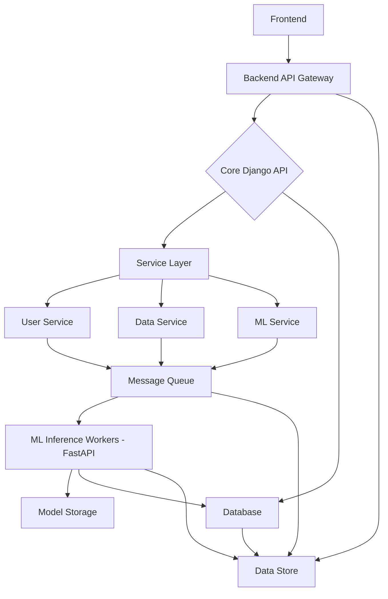
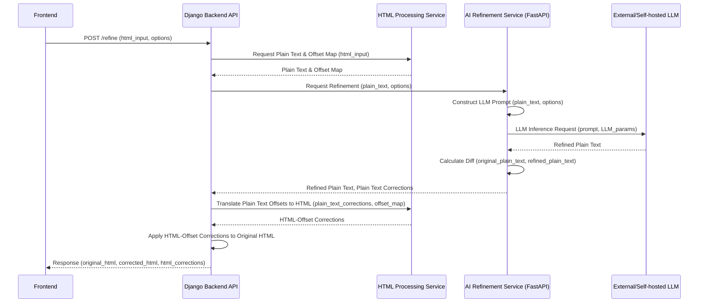

# Advanced AI Writing Assistant Backend System Design.

## Project Vision & Core Capabilities

This report outlines the technical design and implementation plan for an advanced AI-powered writing assistant, an application designed to transcend the capabilities of conventional grammar and spelling checkers. The primary objective is to empower users to produce high-quality, impactful text by offering intelligent, context-aware suggestions, all while meticulously preserving the integrity of the original HTML formatting. This system aims to provide a more sophisticated level of writing assistance, particularly in areas requiring nuanced rephrasing and AI-driven stylistic adjustments.

Unlike existing solutions such as Grammarly, which employ a hybrid approach combining rule-based systems and machine learning models optimized for efficiency and real-time feedback [1], this project targets "more advanced" capabilities. This distinction primarily manifests in its deeper contextual refinement and the ability to perform more profound AI-driven stylistic transformations. The system's design anticipates leveraging advanced Large Language Models (LLMs) to achieve these sophisticated features. The target user base is broad, encompassing anyone who seeks to enhance the clarity, impact, and appropriateness of their written communication, from casual writers to seasoned professionals. The goal is to provide a tool that adapts to specific audiences and desired tones, offering a truly tailored writing experience.

The core functionalities of this writing assistant are segmented into three primary areas: Spelling & Grammar Correction, Sentence Rephrasing, and AI Refinement (Article Revamp).

**Spelling & Grammar Correction:** This module is responsible for the automated detection and suggestion of corrections for lexical and syntactic errors. The output for these corrections will include the original_text, the corrected_text, and a detailed list of individual corrections. Each correction entry will specify the original_text segment, its corrected_text counterpart, its precise position within the HTML input (including HTML offsets), and the type of correction (e.g., 'replacement', 'insertion', 'deletion'). An initial implementation could integrate tools like language_tool_python for fundamental checks, complemented by custom logic to manage the intricacies of HTML offset mapping.

**Sentence Rephrasing:** This feature focuses on generating alternative phrasings for sentences. The aim is to improve clarity, conciseness, or overall flow. The output structure will mirror that of spelling corrections, but the original_text and corrected_text within the corrections list will pertain to sub-sentence units. This functionality will heavily rely on the advanced capabilities of transformer-based LLMs, which are adept at generating coherent and semantically similar text.[2, 3]

**AI Refinement (Article Revamp):** Representing the most advanced aspect of the application, this module provides comprehensive stylistic and structural suggestions for entire paragraphs or larger text blocks. These suggestions are dynamically generated based on user-defined options, including Audience, Tone, Context, Goal, and English Type. This capability demands sophisticated prompt engineering and potentially fine-tuning of LLMs.[4, 5, 6, 7, 8, 9, 10, 11, 12, 13, 14, 15, 16] The output will include the full original_text and corrected_text (the entire revised HTML document), along with a corrections list detailing larger text block changes, potentially with a type such as 'rewrite' or 'restructure'.

The user experience is designed to be seamless. The frontend will transmit HTML-padded text to the backend. The backend will process this text and return a structured JSON response containing the corrections. The frontend will then utilize the provided position data to highlight and display these suggestions directly within the HTML editor interface, allowing users to easily accept or reject them. Crucially, user-provided "Options" (Audience, Tone, Context, Goal, English Type) will serve as critical inputs that guide the AI refinement process, ensuring highly customized output.

A fundamental aspect of achieving the "more advanced" capabilities of this application involves a shift in the underlying machine learning approach. Traditional Grammatical Error Correction (GEC) methods, while effective for basic corrections, are insufficient for the nuanced, context-aware stylistic changes envisioned. The system will instead rely on sophisticated LLM-driven text generation, which inherently supports attribute control. The ability to control output based on parameters such as tone and audience is a core LLM capability, typically achieved through meticulous prompt engineering and decoding-time interventions.[5, 6, 7, 8, 9, 12, 13, 14, 15, 16] This implies that the ML backend will likely operate as a multi-model system, potentially combining a specialized GEC model (or even LanguageTool for basic checks) with a powerful LLM (e.g., a fine-tuned open-source model or an API-based commercial LLM) for rephrasing and advanced AI refinement. This hybrid strategy offers a balanced approach, combining the precision required for fundamental corrections with the flexibility and creativity of LLMs for more advanced features.

The success of the "AI refinement" feature is entirely dependent on the effectiveness of prompt engineering and parameter tuning for the LLMs. The user's explicit requirement for "Audience, Tone, Context, Goal, and English Type" as refinement options directly points to the need for a robust prompt engineering strategy. Research indicates that these attributes are controlled by carefully crafted prompts and LLM generation parameters, such as temperature and top-p.[4, 5, 6, 7, 8, 9, 12, 13, 14, 15, 16] For instance, a lower temperature setting yields more predictable responses, while a higher temperature encourages more creative outputs.[4] Without a sophisticated approach to prompt construction, the LLM's output for "AI refinement" would be generic and fail to meet the user's specific stylistic requirements. This directly influences the complexity of the prompt generation logic within the backend.

The following table provides a high-level overview of how each core feature maps to the primary backend modules and the underlying ML techniques, along with the user-defined options that influence them. This mapping clarifies the scope of each module and highlights the system's modularity and separation of concerns.

| Feature              | Primary Backend Module/Service | Key ML Technique/Model                        | User Options Influencing It                    |
|----------------------|-------------------------------|----------------------------------------------|-----------------------------------------------|
| Spelling & Grammar   | CorrectionService             | Rule-based (LanguageTool), GEC-specific LLM  | None (inherent text properties)               |
| Sentence Rephrasing  | RephrasingService             | Transformer-based LLM (e.g., BART, T5, Llama)| None (focus on semantic equivalence, can be influenced by temperature) |
| AI Refinement        | RefinementService             | Powerful LLM (e.g., GPT-4, Llama-2-70b) via Prompt Engineering | Audience, Tone, Context, Goal, English Type |

## System Architecture Overview

The proposed system architecture for the advanced AI writing assistant adheres to a microservices paradigm. This design choice is not merely a best practice but a fundamental requirement for achieving the desired scalability, maintainability, and resilience in an AI-driven application that incorporates diverse and potentially resource-intensive machine learning models.

### High-Level Component Diagram

The system's high-level structure can be visualized as follows:



The adoption of a microservices architecture is critical for an AI application with varying and potentially high computational demands. The user's requirement for a "production-ready" system with "advanced" AI features necessitates this approach. Microservices offer inherent flexibility and scalability, which are crucial for AI applications that often involve complex computations and large datasets.[17] Monolithic applications, in contrast, frequently encounter issues such as circular dependencies, difficulties in testing, and code duplication.[18] By isolating distinct functionalities into separate services, the system gains independent scaling capabilities, allows for tailored technology choices (e.g., using FastAPI for high-performance ML inference), and enhances fault isolation.[17, 19, 20, 21] This design decision directly supports the "production-ready" and "scalable" requirements by enabling individual services to be optimized, deployed, and scaled independently without affecting the entire system.

### Microservices Design Philosophy

The architectural design embraces several key principles of microservices:

- **Decoupling:** Each service, such as CorrectionService, RephrasingService, and RefinementService, will operate as a self-contained unit, each responsible for a specific business capability.[17] This promotes clear boundaries and reduces inter-service dependencies.
- **Independent Deployment:** Services can be deployed and updated autonomously, without requiring a redeployment or restart of other parts of the system. This facilitates continuous integration and rapid iteration.[17]
- **Technology Heterogeneity:** The architecture allows for the selection of the most appropriate technology for each specific task. For instance, Django is well-suited for the core API and data management, while FastAPI is ideal for high-performance ML inference.[19, 20]
- **Scalability:** Individual services can be scaled horizontally by adding more instances based on demand, ensuring the system can handle increasing workloads without performance degradation.[17, 23]
- **Resilience:** The isolation of services means that a failure in one microservice does not cascade and bring down the entire application, thereby enhancing overall system reliability.[17]

### Technology Stack Selection Rationale

The selection of the technology stack is driven by the project's requirements for robustness, performance, and scalability, while also adhering to the user's explicit preference for Python and Django.

**Backend Framework (Core API): Django with Django REST Framework (DRF)**

- **Rationale:** The user explicitly requested Django. Django, when paired with Django REST Framework (DRF), offers a comprehensive toolset for rapidly building RESTful APIs, including a powerful Object-Relational Mapper (ORM), built-in authentication, and an administrative interface.[22, 24, 25] This makes it an excellent choice for managing user requests, orchestrating calls to various ML services, and handling database interactions.
- **Considerations:** While Django is robust, it can be feature-heavy for very lightweight services and may present a steeper learning curve compared to simpler frameworks.[22] However, its extensive ecosystem and proven track record in complex applications outweigh these considerations for the core API layer.

**ML Inference Framework (Dedicated Services): FastAPI**

- **Rationale:** FastAPI is chosen for dedicated ML microservices due to its high performance, asynchronous support, and suitability for real-time NLP applications.[19, 20] It automatically generates OpenAPI documentation, which simplifies API development and consumption. The low latency and high throughput capabilities of FastAPI are critical for serving ML models efficiently. It can be seamlessly integrated with a Django backend.[21]
- **Considerations:** FastAPI is less feature-rich than Django, meaning more boilerplate code might be required for complex use cases.[22] However, its performance focus aligns perfectly with the demands of ML inference.

**Asynchronous Task Queue: Celery with Redis/RabbitMQ**

- **Rationale:** Machine learning model inference, particularly with Large Language Models, can be computationally intensive and time-consuming. To ensure a responsive user experience, asynchronous processing is crucial. Celery, a widely adopted task queue for Python, enables the offloading of long-running tasks from the main request-response cycle, preventing blocking behavior. Redis or RabbitMQ will serve as the message brokers for Celery.[26]
- **System Impact:** The inherent latency of LLM inference directly impacts user experience and system scalability. LLMs, especially larger ones, are computationally demanding and can be slow.[1, 20] Direct synchronous calls from the main Django application for every correction or refinement request would lead to high latency and a poor user experience, potentially overwhelming the server. The adoption of asynchronous processing with a task queue like Celery is therefore essential. This allows the API to return quickly while the ML task executes in the background. This design choice directly improves responsiveness, increases system throughput (ability to handle more concurrent requests), and enhances overall scalability by decoupling request handling from heavy computation.

**HTML Parsing & Offset Mapping: chopdiff library**

- **Rationale:** Handling HTML-padded input and accurately tracking word positions with HTML offsets is a complex technical challenge. The chopdiff library is specifically designed for manipulating text, Markdown, and HTML documents, crucially maintaining exact offsets of each token in the original document text, including HTML tags as single tokens.[27, 28] This capability is paramount for accurately mapping plain text corrections back to their precise positions within the original HTML structure. Furthermore, its word-level diffing capabilities will be essential for identifying the original_text, corrected_text, and type of corrections.
- **Considerations:** chopdiff is not a full HTML Document Object Model (DOM) parser like BeautifulSoup. Therefore, custom logic may be necessary if complex DOM manipulation is required beyond simple text replacement and offset tracking.

**Database: PostgreSQL**

- **Rationale:** PostgreSQL, a robust relational database, is well-suited for storing structured data and managing relationships between tables.[25] It will be used to store user data, historical correction requests, application settings, and potentially custom dictionaries or user-specific preferences.

**Containerization: Docker**

- **Rationale:** Docker provides a consistent and isolated environment for deploying NLP models, ensuring reproducibility across different systems and simplifying dependency management.[20] It is essential for packaging each microservice into portable units.

**Orchestration: Kubernetes**

- **Rationale:** For enterprise-level NLP applications with multiple microservices, Kubernetes offers robust orchestration capabilities, including automatic scaling, self-healing infrastructure, and advanced load balancing.[20] This is crucial for managing the deployment, scaling, and operational aspects of the microservices in a production environment.

The following table summarizes the key technologies chosen for the project, their primary roles, and any notable considerations.

| Component          | Technology/Tool         | Key Role/Rationale                                                                 | Trade-offs                                    |
|--------------------|------------------------|-----------------------------------------------------------------------------------|-----------------------------------------------|
| Core API           | Django + DRF           | User-requested, robust, comprehensive toolset for REST APIs, auth, ORM.            | Can be heavy for simple services, steeper learning curve. |
| ML Inference       | FastAPI                | High performance, async support, ideal for real-time NLP inference, auto-docs.     | Less feature-rich than Django, requires more boilerplate for complex API logic. |
| Async Task Queue   | Celery (with Redis/RabbitMQ) | Manages long-running ML tasks asynchronously, improves responsiveness.             | Adds operational complexity (broker, workers). |
| HTML Processing    | chopdiff               | Preserves HTML offsets, handles tags as tokens, word-level diffs, re-stitching.    | Not a full DOM parser; custom logic needed for complex HTML manipulation beyond text. |
| Database           | PostgreSQL             | Robust, scalable relational database for structured data, user info, history.      | Requires dedicated database management.       |
| Containerization   | Docker                 | Ensures consistent environments, simplifies dependency management, portability.    | Adds a layer of abstraction, requires Docker knowledge. |
| Orchestration      | Kubernetes             | Automates deployment, scaling, and management of microservices in production.      | Significant setup and operational complexity.  |

## Deep Dive: HTML Processing & Offset Management

The requirement to handle HTML-padded input, track wrong words, and return corrected words with their positions, specifically with offsets that include HTML tags, represents the most technically demanding aspect of this project. This necessitates a bespoke offset mapping solution rather than relying on off-the-shelf plain text processing.

### Challenges of HTML-Aware Text Correction

Processing HTML-padded input for text correction introduces several complexities:

- **HTML Tag Interference:** HTML tags, such as `<p>`, `<strong>`, and `<span>`, are integral parts of the input string but are not considered part of the actual plain text that machine learning models process. Their presence significantly affects character offsets within the original string.
- **HTML Entities:** Character entities like `&nbsp;` (non-breaking space) or `&amp;` (ampersand) represent single characters in plain text but occupy multiple characters in the HTML string. This disparity further complicates accurate offset mapping. For example, `&nbsp;` is 6 characters long in the HTML source but corresponds to a single space character in the plain text.
- **Dynamic Content:** While the initial focus will be on static HTML content, potential complexities could arise from JavaScript-generated content or intricate CSS that might dynamically alter the perceived text structure.
- **Maintaining Formatting:** A critical requirement is that corrections must be applied without corrupting or losing any of the original HTML formatting and attributes.[29] This means modifications must be surgical, targeting only the text content while leaving surrounding tags untouched.
- **The "Position" Requirement:** The user's sample output explicitly demonstrates that the position data (e.g., `{'start': 27, 'end': 28}` for "th") refers to offsets within the original HTML string, including the characters occupied by tags and entities. This is the core technical hurdle, as standard NLP tools operate on plain text, and typical HTML parsers do not easily provide this character-level mapping back to the original HTML string while accounting for variable tag and entity lengths. A simple strip_tags followed by a text replacement would fail to provide accurate HTML offsets. This complexity directly impacts development time, the potential for bugs, and the choice of low-level text manipulation libraries.

### Parsing HTML to Plain Text with Offset Mapping

To address these challenges, a custom HTML parsing approach is required. This approach must simultaneously extract plain text and build a precise mapping of plain text character offsets to their corresponding original HTML character offsets.

The **chopdiff** library emerges as a highly suitable tool for this task. It is specifically designed for manipulating text, Markdown, and HTML documents, crucially maintaining exact offsets of each token in the original document text, including HTML tags as single tokens.[28] This capability is instrumental in constructing the necessary offset mapping.

The process will involve the following steps:

1. **Tokenization:** Utilize chopdiff's TextDoc and tokenization features to break down the raw HTML input into a sequence of "wordtoks." Each of these tokens (which can be actual words, whitespace, punctuation, or HTML tags) will carry its start and end offset relative to the original HTML string.[28]
2. **Plain Text Extraction & Offset Mapping:** Iterate through the chopdiff tokens. When a "data" token (representing a word, punctuation, or whitespace) is encountered, its content is appended to a plain text string. Concurrently, the start and end offsets of this data token from the original HTML string are recorded. This process builds a comprehensive mapping: plain_text_offset -> html_offset_range.
3. **Entity Handling:** HTML entities (e.g., `&nbsp;`, `&amp;`) need careful handling. html.unescape() can convert these entities to their corresponding Unicode characters.[30] This conversion must occur during plain text extraction, and the offset mapping must accurately account for the change in character length. chopdiff's tokenization, by treating entities as part of data tokens, can simplify this process.

### Applying Corrections and Re-composing HTML

Once the plain text is extracted and the offset mapping is established, the workflow proceeds as follows:

1. **ML Model Input:** The extracted plain text is fed to the various ML models (spelling, rephrasing, refinement).
2. **ML Model Output:** The ML models return a list of corrections, each containing the original_text, corrected_text, and position (which are plain text offsets).
3. **Offset Translation:** For each correction received from the ML model, the pre-computed plain_text_offset -> html_offset_range mapping is used to translate the ML model's plain text start and end positions into corresponding start and end positions within the original HTML string. This is a complex step that requires precise alignment of character indices.
4. **Correction Type Determination:** The type of correction (insertion, replacement, deletion) is determined by comparing the original_text and corrected_text from the ML output. If original_text is empty but corrected_text exists, it signifies an insertion. Conversely, if corrected_text is empty but original_text exists, it indicates a deletion. Otherwise, it is a replacement. Advanced diffing algorithms, such as Google's diff_match_patch (utilized by xmldiff [31]) or chopdiff's word-level diffs [28], can provide more granular and accurate type information. The type field in the corrections output implies a need for a robust text diffing algorithm beyond simple string comparison. This adds another layer of processing to the ML output; the diffing algorithm must be integrated into the post-processing pipeline of the ML services to enrich the correction data, which is vital for the frontend's visual representation of changes.
5. **HTML Re-composition:** After all corrections are translated to HTML offsets, the original HTML string must be modified. This involves iterating through the HTML string and, at each correction's start position, inserting the corrected_text and removing the original_text (or performing insertions/deletions as appropriate). Careful management of shifting offsets for subsequent text is crucial due to insertions or deletions. This is a common challenge in text editing and requires a robust patching mechanism. chopdiff's ability to "re-stitch the results back together with best alignments" [28] is highly relevant here. The final corrected_text (the full HTML string) and the corrections array (with HTML offsets) are then returned.

### Proposed Python Libraries & Custom Logic

**Primary Tool: chopdiff [27, 28]**

- **Capabilities:** Its tokenization (which includes HTML tags as tokens), exact offset preservation, word-level diffs, and ability to "re-stitch" transformed text make it uniquely suited for the problem of maintaining HTML offsets. The existence of a library like chopdiff enables the practical implementation of HTML-aware offset tracking without requiring the development of an entire custom HTML parser from scratch that handles all edge cases of tags and entities. This choice significantly reduces development complexity and increases the likelihood of accurate offset reporting, which is crucial for the frontend's highlighting functionality.
- **Usage:** chopdiff will be central to creating the plain text to HTML offset map and applying corrections.

**Auxiliary: html.parser [30, 32]**

- **Capabilities:** Python's standard library for parsing HTML. While chopdiff will handle the heavy lifting for offsets, html.parser can be used for initial validation or if more granular control over specific HTML elements is needed.
- **Limitation:** getpos() returns line and column, not global character offset, and does not inherently provide the plain text to HTML offset mapping required for this application.

**Custom Offset Tracker:** A custom class or set of functions will be built on top of chopdiff's tokenization. This component will manage the precise mapping between plain text and HTML offsets and handle the application of changes. It will involve careful accounting for the length of HTML tags and entities to ensure accuracy.

**Diffing Logic:** The system will utilize chopdiff's word-level diffs or integrate Google's diff_match_patch algorithm (as xmldiff does [31]) to accurately determine insertion, deletion, or replacement types and their exact boundaries in the plain text before translating them to HTML offsets.

The following table details the expected input and output JSON schema for the correction endpoint, providing a precise contract for API interactions.

| Field Name                    | Data Type       | Description                                                                    | Example Value                                | Notes                                           |
|-------------------------------|-----------------|--------------------------------------------------------------------------------|---------------------------------------------|-------------------------------------------------|
| original_text                 | string          | The full HTML-padded input text.                                               | `<p>It&nbsp;is&nbsp;in&nbsp;th&nbsp;way&nbsp;you&nbsp;luk&nbsp;at&nbsp;me</p>` |                                                 |
| corrected_text                | string          | The full HTML-padded text after corrections.                                    | `<p>It&nbsp;is&nbsp;in&nbsp;the&nbsp;way&nbsp;you&nbsp;look&nbsp;at&nbsp;me</p>` |                                                 |
| corrections                   | array of objects| List of individual corrections applied.                                         | [...]                                       |                                                 |
| corrections.original_text     | string          | The original text segment that was corrected.                                   | `th`                                        |                                                 |
| corrections.corrected_text    | string          | The corrected text segment.                                                     | `the`                                       |                                                 |
| corrections.position           | object          | Start and end offsets of the original_text within the original HTML string.     | `{'start': 27, 'end': 28}`                  | Offsets include HTML tags and entities.         |
| corrections.position.start    | integer         | Starting character offset in original HTML.                                     | `27`                                        |                                                 |
| corrections.position.end      | integer         | Ending character offset in original HTML.                                       | `28`                                        |                                                 |
| corrections.type              | string          | Type of correction: 'insertion', 'replacement', 'deletion'.                     | `insertion`                                 | Determined by diffing algorithm.                |

## AI/ML Backend: Core Correction Modules

The core of the advanced AI writing assistant resides within its specialized AI/ML backend modules. These modules are designed to handle the diverse range of writing correction functionalities, from basic spelling to complex stylistic refinement. The design emphasizes model selection, seamless integration, and efficient data flow.

### Grammar & Spelling Correction Engine

A hybrid approach is recommended for grammar and spelling correction to balance speed, accuracy, and the ability to handle nuanced errors.

**Rule-based/Statistical Layer (e.g., LanguageTool):** For common grammatical errors and spelling mistakes, a tool like language_tool_python can provide fast and accurate initial checks.[33, 34] This layer is efficient for identifying straightforward errors. However, it is important to note the limitations of the public LanguageTool API, which includes restrictions on requests per minute (20), text per minute (75KB), text per request (20KB), and a maximum of 30 suggestions per request for the free version.[33, 34] For production-scale deployment, a self-hosted instance or a premium plan would be necessary. A benefit of LanguageTool is its ability to provide ruleIssueType, which can be mapped to the type field in the system's output.

**LLM-based GEC (for more complex errors):** For nuanced grammatical errors, subtle style issues, and context-dependent corrections that rule-based systems might overlook, a fine-tuned Large Language Model (LLM) can be employed. State-of-the-art Grammatical Error Correction (GEC) models often leverage Transformer architectures such as BART, T5, or Llama3.[35] Commercial LLMs like GPT-4 and GPT-3.5 Turbo are also utilized for GEC tasks.[36] Research in explainable GEC, such as the EXGEC framework, focuses on integrating explanation and correction, which aligns with the project's need for "detailed corrections".[35]

The workflow for grammar and spelling correction will involve:

1. Receiving plain text from the HTML processing layer.
2. Passing this text to LanguageTool (if a self-hosted or premium instance is used) for initial checks.
3. Passing the text (and potentially initial corrections from LanguageTool) to a GEC-specific LLM for further, more nuanced refinement.
4. Aggregating corrections from both sources.
5. Translating the plain text offsets of these corrections to HTML offsets using the mapping provided by the HTML processing layer.

### Sentence Rephrasing Mechanism

Sentence rephrasing will primarily leverage the power of transformer-based Large Language Models (LLMs), which are inherently well-suited for paraphrase generation.[2, 3] Foundational models like BART, BERT, and XLNet are examples of architectures that can be adapted for this task.[2]

**Prompt Engineering:** The input sentence will be encapsulated within a carefully constructed prompt that instructs the LLM to rephrase it while retaining its original meaning. An example prompt structure might be: "Rephrase the following sentence to improve clarity and conciseness:".[8, 14]

**Controllability:** While the main objective is semantic equivalence, LLM parameters like temperature can be adjusted to control the creativity and diversity of the rephrased output.[4] A lower temperature would yield more direct rephrasing, while a higher temperature could introduce more varied phrasing options.

The workflow for sentence rephrasing will include:

1. Receiving plain text segments (typically individual sentences) from the HTML processing layer.
2. Constructing a specific prompt for the LLM for each segment, explicitly requesting rephrasing.
3. Invoking the LLM inference service.
4. Receiving the rephrased text from the LLM.
5. Generating diffs between the original and rephrased segments to accurately identify changes and their types (e.g., replacement of words or phrases).
6. Translating the plain text offsets of these changes to HTML offsets.

### AI Refinement & Style Control Module (Article Revamp)

This module represents the most advanced capability of the system, relying heavily on powerful LLMs to perform comprehensive text refinement and stylistic adjustments. This will involve using models such as fine-tuned open-source LLMs (e.g., Llama-2-70b) or commercial LLM APIs (e.g., GPT-4).[36]

**Conditional Text Generation:** The LLM will perform conditional text generation, where the conditions are the user-specified Options: Audience, Tone, Context, Goal, and English Type.[5, 10, 11, 37, 38]

**Prompt Engineering for Attribute Control:** This module will construct sophisticated prompts that embed the user's selected Options to precisely guide the LLM's output style and content.[6, 7, 8, 9, 10, 12, 13, 14, 15, 16]

**Strategy:** Effective prompt engineering involves more than simple keyword injection. It requires defining roles, providing context, setting explicit instructions, and using examples.[6, 7, 8, 9, 12, 13, 14, 15, 16] This implies a backend component dedicated to translating the user's structured options into a well-formed, multi-part prompt that maximizes the LLM's ability to generate text with the desired attributes. The quality of the output is directly proportional to the sophistication of this prompt generation logic, suggesting the need for a "prompt template" system to manage different refinement scenarios.[15]

**Examples of Prompt Elements:**

- **Audience:** Instructions like "Adjust the language to suit a [Audience] audience" will be incorporated.[6, 8, 12]
- **Tone:** Explicitly stating "Maintain a [Tone] tone throughout" will guide the LLM.[7, 8, 12]
- **Context:** Providing background such as "The following text is part of a [Context] report" helps the model understand the domain.[6, 7, 14, 15, 16]
- **Goal:** Using action verbs like "Revamp this section to [CONVINCE] potential clients" specifies the desired outcome.[6, 14]
- **English Type:** Explicitly instructing the LLM on the desired dialect, e.g., "Use [English Type] English conventions."

**Leveraging LLM Parameters:** Adjusting LLM generation parameters is crucial for fine-tuning the output's creativity, diversity, and adherence to style.[4, 5, 11, 13] These parameters act as "control knobs" that allow fine-tuning the style and creativity of the generated text, enabling a more dynamic and user-responsive refinement process.[4] This means the backend should not just pass text to the LLM but also dynamically set these parameters based on the user's Tone and Goal options.

- **temperature:** This parameter controls the randomness and creativity of the output. Lower values (e.g., 0.1) result in more focused and predictable responses, suitable for formal or factual tones. Higher values (e.g., 0.9) lead to more creative and varied outputs, ideal for friendly or storytelling tones.[4]
- **top-p (Nucleus Sampling) & top-k (Token Sampling):** These parameters influence the diversity of the output by controlling the token selection pool.[4, 13] They are valuable for balancing creativity and coherence.
- **frequency_penalty & presence_penalty:** These parameters help reduce repetition in the generated text, ensuring the refined output is not redundant.[4]
- **max_new_tokens:** This parameter directly controls the maximum length of the generated output, which is important for managing response size.[4, 11]
- **Decoding-Time Intervention:** This advanced technique involves modifying the decoding algorithm itself to influence specific attributes of the generated text without requiring full model retraining.[5]

The workflow for AI refinement will involve:

1. Receiving the full plain text from the HTML processing layer, along with the options dictionary.
2. Constructing a comprehensive prompt that incorporates the text and all specified options.
3. Invoking the LLM inference service.
4. Receiving the refined text.
5. Performing a diff between the original and refined text (at a paragraph or sentence level) to identify changes.
6. Translating the plain text offsets of these changes to HTML offsets.

### ML Model Selection & Integration Strategies

The "more advanced" capabilities of this system necessitate a multi-modal ML architecture, combining specialized GEC models with powerful LLMs. This introduces complexity in model management and orchestration. Simple grammar and spelling checks can be handled by dedicated GEC models or rule-based systems like LanguageTool, which prioritize precision and speed for common errors.[1, 33] However, rephrasing and advanced refinement (Audience, Tone, Context, Goal) are inherently generative tasks that require the flexibility and understanding of LLMs.[2, 3, 5, 10, 37] This means the backend will operate as a pipeline where different models handle different aspects of the correction, requiring careful orchestration and data flow between them. This architectural choice results in higher operational complexity (managing multiple models, their versions, dependencies, and resource requirements) and potentially higher infrastructure costs (especially for LLMs), but it offers superior performance for diverse tasks compared to a monolithic approach.

**Hybrid Model Strategy:** A combination of specialized GEC models (potentially LanguageTool or fine-tuned smaller models) for precision and LLMs for generative tasks (rephrasing, refinement) offers the best balance of accuracy, speed, and advanced capabilities.[1]

**LLM Deployment:**

- **API-based LLMs (e.g., OpenAI GPT-x, Google Gemini):** These offer quick integration and offload infrastructure management, but they incur per-token costs and are subject to rate limits. They are suitable for initial prototyping and handling complex, general-purpose tasks.
- **Self-hosted Open-source LLMs (e.g., Llama, Mistral):** These provide more control over the model, eliminate per-token costs (after initial infrastructure investment), and can be fine-tuned on specific datasets for better domain adaptation.[36, 39] However, they require significant computational resources (GPUs) for inference.[1, 20]
- **Fine-tuning:** For achieving specific task performance or domain expertise, fine-tuning pre-trained Transformer models [3, 39, 40] is a powerful strategy. This involves further training the model on task-specific data.
- **Parameter-Efficient Fine-Tuning (PEFT) / Prompt Tuning / LoRA:** These techniques [3] offer efficient ways to adapt large pre-trained models with significantly fewer trainable parameters, reducing computational cost and time compared to full fine-tuning.

**Integration:** ML models will be exposed via dedicated FastAPI microservices [19, 20, 21] and integrated with the main Django backend via REST APIs.[25] For higher efficiency in inter-service communication, gRPC could be considered.[25] Asynchronous calls via Celery will manage long-running inference tasks, ensuring system responsiveness.[26]

The choice between API-based and self-hosted LLMs is a critical trade-off between development speed/operational overhead and cost/customization/data privacy. While API-based LLMs are easy to integrate and manage infrastructure, they come with per-token costs and potential data privacy implications. Self-hosting open-source LLMs offers cost control and customization through fine-tuning but demands significant computational resources (GPUs) and expertise for deployment and management.[1, 19, 20] This decision impacts the project's budget, infrastructure requirements, data security posture, and the degree of control over the AI's behavior. A phased approach might be considered, starting with API-based models for rapid prototyping and then transitioning to self-hosted/fine-tuned models for cost optimization and specialized performance as the product matures.

The following table provides a suitability matrix for different ML model types across the various correction tasks.

| Correction Task      | Recommended Model Type                     | Strengths                                    | Weaknesses                                 | Key Considerations                           |
|----------------------|-------------------------------------------|----------------------------------------------|--------------------------------------------|---------------------------------------------|
| Spelling             | Rule-based (LanguageTool) / Small GEC Model| Fast, precise for common errors, low resource.| Limited to known rules, less context-aware.| Latency, cost (API limits for LT).          |
| Grammar              | Hybrid (LanguageTool + GEC LLM)           | Combines precision with nuanced understanding.| Increased complexity, resource demands.    | Explainability, fine-tuning needs.          |
| Sentence Rephrasing  | General LLM (fine-tuned)                  | High semantic understanding, creative rephrasing.| Higher latency, computational cost.       | Prompt engineering for quality, diversity.  |
| AI Refinement        | Powerful LLM (API or self-hosted, fine-tuned)| Deep contextual understanding, stylistic control.| Highest latency, significant computational/financial cost.| Extensive prompt engineering, parameter tuning, data privacy. |

## Controllable Text Generation: Audience, Tone, Context, Goal, English Type

Achieving precise control over the "Audience, Tone, Context, Goal, and English Type" for the AI refinement module is paramount for delivering an advanced writing assistant. This capability is primarily realized through sophisticated prompt engineering, which dynamically constructs prompts based on user selections, moving beyond simple keyword injection.

### Prompt Engineering for Attribute Control

The core principle behind controllable text generation with LLMs is the careful crafting of the input prompt. LLMs can be guided to generate text with specific attributes such as sentiment, style, tone, and topic by structuring the prompt effectively.[5, 37] This process acts as a "textual GUI" for AI systems, allowing users to influence model behavior through natural language.[15]

Effective prompts typically comprise several key components:

- **Instruction:** A clear and direct directive outlining the task the LLM should perform (e.g., "Rewrite the following paragraph...").[13, 14, 16]
- **Context:** Background information that helps the model understand the scope of the request and narrow down the vast possibilities of text generation (e.g., "The text is for a business report.").[6, 7, 13, 14, 16]
- **User Input:** The actual text content that needs to be processed.
- **Persona (Optional):** Assigning a specific role to the model (e.g., "You are a professional editor.") can further tailor the responses.[13]
- **Output Format & Tone:** Explicitly defining how the response should look and sound ensures consistency and adherence to desired stylistic guidelines.[8, 13]
- **Examples (Few-Shot Prompting):** Providing one or more examples of desired input-output pairs can significantly improve output quality, guiding the model's focus and desired format or tone.[9, 12, 13, 16]

The backend component responsible for AI refinement will have a significant sub-module dedicated to prompt construction. This module will take the user's structured options and translate them into a well-formed, multi-part prompt that maximizes the LLM's ability to generate text with the desired attributes. The quality of the output is directly proportional to the sophistication of this prompt generation logic, which also suggests the need for a "prompt template" system to manage different refinement scenarios.[15]

Here's how user options will be mapped to prompt elements:

- **Audience (GENERAL, PROFESSIONAL, ACADEMIC):** The prompt will explicitly specify the target audience. For instance, "Target audience: [Audience]." or "Adjust the language to suit a [Audience] audience".[6, 8, 12]
- **Tone (FRIENDLY, FORMAL, CONFIDENT, CURIOUS):** The desired tone will be explicitly stated in the prompt, such as "Maintain a [Tone] tone throughout" or "Rewrite this paragraph in a [Tone] tone".[7, 8, 12] This can be further influenced by LLM parameters like temperature.
- **Context (FREELANCE, CREATIVE, BUSINESS, BRANDING, REPORTS):** Background information about the document's purpose or domain will be provided. Examples include "The following text is part of a [Context] document" or "Considering this is for a [Context] campaign, refine the text".[6, 7, 14, 15, 16]
- **Goal (EXPLAIN, STANDOUT, TELL_A_STORY, CONVINCE):** Action verbs will be used to specify the desired outcome. For example, "The primary goal is to [GOAL] the reader" or "Revamp this section to [CONVINCE] potential clients".[6, 14]
- **English Type (AMERICAN, BRITISH, NIGERIAN):** The prompt will explicitly instruct the LLM on the desired dialect, such as "Use [English Type] English conventions."

### Leveraging LLM Parameters for Refinement

Beyond prompt construction, LLM generation parameters are crucial "control knobs" that allow fine-tuning the style and creativity of the generated text, enabling a more dynamic and user-responsive refinement process.[4] These parameters directly influence aspects like creativity, coherence, accuracy, and even output length.[4] The backend will dynamically set these parameters based on the user's Tone and Goal options.

- **temperature:** This parameter controls the randomness and creativity of the output. Lower values (e.g., 0.1) result in more focused and predictable responses, suitable for formal or factual tones. Higher values (e.g., 0.9) lead to more creative and varied outputs, ideal for friendly or storytelling tones.[4]
- **top-p (Nucleus Sampling) & top-k (Token Sampling):** These parameters influence the diversity of the output by controlling the token selection pool.[4, 13] They are useful for striking a balance between creativity and coherence.
- **frequency_penalty & presence_penalty:** These parameters are used to reduce repetition in the generated text, ensuring the refined output is concise and avoids redundancy.[4]
- **max_new_tokens:** This parameter directly controls the maximum length of the generated output, which is important for managing response size and preventing overly verbose results.[4, 11]
- **Decoding-Time Intervention:** This advanced technique involves modifying the decoding algorithm itself to influence specific attributes of the generated text without requiring full model retraining.[5]

### Managing English Dialect Variations

Controlling English dialect, especially for less common variants like Nigerian English, presents a significant challenge. While LLMs are trained on vast datasets, their proficiency across all specified English types cannot be guaranteed without additional training. The training data distribution of LLMs often favors dominant English types (American, British). Prompting for "Nigerian English" might yield generic results or subtle inaccuracies if the model has not been exposed to sufficient data from that specific dialect. This indicates a potential limitation or a need for a more complex solution.

**Strategies:**

- **Explicit Prompting:** Providing clear instructions and potentially examples (few-shot prompting) of the desired dialect's specific conventions (vocabulary, spelling, grammar nuances) can help guide the LLM.
- **Fine-tuning:** For high-fidelity adherence to a specific dialect, fine-tuning an LLM on a large corpus of text in that dialect would be the most effective approach. However, this is resource-intensive.
- **Hybrid Approach:** For less common dialects, a combination of general LLM refinement followed by a rule-based post-processing layer or a smaller, specialized model trained specifically on that dialect could be considered to bridge the gap.

The diversity of "English Type" options introduces a potential gap in out-of-the-box LLM performance. This necessitates a design decision: either accept a lower fidelity for less common dialects or invest in data collection and fine-tuning, which carries significant cost and time implications. This directly impacts the "advanced" claim for this specific feature.

The following table illustrates how user preferences for text refinement are translated into concrete technical instructions for the LLM, highlighting the interplay between user options, prompt elements, and LLM parameters.

| User Option  | Corresponding Prompt Element/LLM Parameter | Description of Effect                                                                 | Example                                          |
|--------------|-------------------------------------------|--------------------------------------------------------------------------------------|-------------------------------------------------|
| Audience     | Target audience: [Audience]               | Guides vocabulary, sentence structure, and complexity to match reader's expertise.    | "Adjust for a PROFESSIONAL audience."           |
| Tone         | Maintain a [Tone] tone., temperature       | Influences emotional tenor, formality, and overall voice of the text.                 | "Rewrite in a CONFIDENT tone." (Lower temperature for formal, higher for friendly) |
| Context      | The text is for a [Context] document.      | Provides domain-specific background, influencing factual accuracy and relevant phrasing.| "Refine for a BUSINESS report."                 |
| Goal         | The primary goal is to [GOAL] the reader.  | Directs the LLM to optimize text for a specific communicative objective.              | "Revamp to CONVINCE clients."                   |
| English Type | Use [English Type] English conventions.    | Specifies regional spelling, vocabulary, and grammatical norms.                       | "Use AMERICAN English." (Requires specific data/fine-tuning for non-standard dialects) |

## UML Diagrams

UML diagrams are essential for visualizing the system's structure, behavior, and interactions, providing a clear blueprint for development and communication among stakeholders.

### Use Case Diagram

The Use Case Diagram illustrates the primary interactions between the users (Actors) and the system, defining the functionalities from an external perspective.

```mermaid
graph TD
    actor User
    actor ML_Engineer

    User --> (Submit HTML Text);
    User --> (Select Refinement Options);
    User --> (View Corrections);
    User --> (Accept/Reject Corrections);
    User --> (Request Rephrasing);
    User --> (Request AI Refinement);

    ML_Engineer --> (Monitor ML Services);
    ML_Engineer --> (Update ML Models);
    ML_Engineer --> (Manage Prompt Templates);
    ML_Engineer --> (Analyze Model Performance);

    (Submit HTML Text).> (Parse HTML Input) : include
    (View Corrections).> (Translate Offsets) : include
    (Request Rephrasing).> (Generate Rephrasing) : include
    (Request AI Refinement).> (Generate Refinement) : include
    (Generate Rephrasing).> (Apply Prompt Engineering) : include
    (Generate Refinement).> (Apply Prompt Engineering) : include
    (Generate Rephrasing).> (Perform LLM Inference) : include
    (Generate Refinement).> (Perform LLM Inference) : include
    (Generate Rephrasing).> (Calculate Text Diff) : include
    (Generate Refinement).> (Calculate Text Diff) : include
    (View Corrections).> (Highlight HTML Changes) : include
```

### Activity Diagram

The Activity Diagram models the flow of control and actions involved in the core process of HTML text correction and refinement.

```mermaid
graph TD
    start --> A{Receive HTML Input};
    A --> B;
    B --> C{Determine User Request Type};

    C --> |Spelling/Grammar| D;
    C --> |Sentence Rephrasing| E;
    C --> |AI Refinement| F;

    D --> G;
    E --> H;
    F --> I;

    G --> J{Get Plain Text Corrections};
    H --> K;
    I --> L;

    K --> M{Get Rephrased Text};
    L --> N{Get Refined Text};

    J --> O;
    M --> P;
    N --> Q;

    O --> R[Format Corrections Output];
    P --> R;
    Q --> R;

    R --> S;
    S --> T{Return Corrected HTML & Corrections JSON};
    T --> end;
```

### Sequence Diagram

The Sequence Diagram illustrates the interactions between objects in the system for a typical AI Refinement request, showing the order of messages.



## System Design and Design Decisions

The system design for the advanced AI writing assistant prioritizes a modular, scalable, and resilient architecture to handle the complexities of HTML-aware text processing and advanced AI-driven content refinement.

### Microservices Architecture Rationale

The decision to adopt a microservices architecture is fundamental to the system's ability to meet its "production-ready" and "advanced" requirements. This approach offers several compelling advantages:

- **Scalability:** Different components of the system have varying computational demands. For instance, basic spelling checks are relatively lightweight, while LLM-driven AI refinement can be highly resource-intensive. Microservices allow independent scaling of these components. The FastAPI-based ML inference services can be scaled horizontally by adding more instances to handle increased traffic, without affecting the core Django API or other services.[17, 23] This ensures efficient resource utilization and optimal performance under varying loads.
- **Flexibility and Technology Heterogeneity:** The microservices paradigm enables the selection of the most suitable technology stack for each specific service. Django, with its robust ORM and administrative capabilities, is ideal for the core application logic and data management. In contrast, FastAPI's high performance and asynchronous capabilities make it superior for real-time ML inference.[19, 20] This flexibility allows developers to leverage the strengths of different frameworks, leading to more optimized and efficient individual services.
- **Resilience and Fault Isolation:** In a microservices architecture, the failure of one service does not propagate and bring down the entire application. If, for example, the AI Refinement Service experiences an issue, the Spelling/Grammar and Sentence Rephrasing services can continue to operate independently.[17] This enhances the overall reliability and availability of the system, which is crucial for a production environment.
- **Maintainability and Development Velocity:** Decoupling functionalities into smaller, self-contained services simplifies development, testing, and deployment. Development teams can work in parallel on different microservices, reducing time-to-market for new features and updates.[17] This modularity also simplifies debugging and makes the codebase easier to maintain over time, preventing the accumulation of technical debt often seen in monolithic applications.[18]

### Data Flow and Asynchronous Processing

The data flow within the system is designed to be efficient and handle the inherent latency of LLM inference.

1. **HTML Input Reception:** The Frontend submits HTML-padded text to the Django Backend API.
2. **HTML Processing:** The Django API forwards the HTML to a dedicated HTML Processing Service (potentially a chopdiff-wrapper microservice). This service extracts plain text and, critically, generates a precise mapping of plain text character offsets back to the original HTML string offsets. This mapping is essential for re-composing the HTML with corrections later.
3. **ML Task Initiation (Asynchronous):** For computationally intensive tasks like Sentence Rephrasing and AI Refinement, the Django API dispatches requests to an asynchronous task queue (Celery). This is a crucial design decision. LLM inference can be slow and resource-heavy.[1, 20] By offloading these tasks to Celery workers, the main Django API remains responsive, providing immediate feedback to the user while the heavy processing occurs in the background.[26] This prevents blocking the main thread, improving user experience and allowing the system to handle a higher volume of concurrent requests.
4. **ML Inference:** Celery workers, which are essentially Python processes running in the background, pick up tasks from the queue. These workers interact with the FastAPI-based ML Inference Services. These services host the actual LLMs (either via API calls to external providers or by running self-hosted models).
5. **Correction Generation:** The ML Inference Services perform the necessary text transformations (grammar checks, rephrasing, refinement) on the plain text. They return the corrected plain text along with plain text offsets of the changes.
6. **Offset Translation and HTML Re-composition:** The plain text corrections and their offsets are sent back to the Django API. The Django API then uses the previously generated HTML-to-plain-text offset map to translate these plain text offsets into precise HTML string offsets. Finally, the Django API applies these corrections to the original HTML string, ensuring formatting is preserved and the corrected_text and corrections JSON output adheres to the specified format.

### Core Application Details (ML Aspect)

The ML aspect is the core differentiator of this application. Its design centers around a multi-model approach and sophisticated prompt engineering.

**Multi-Model Strategy:** The system employs a hybrid strategy, combining specialized Grammatical Error Correction (GEC) models (potentially including rule-based systems like LanguageTool for efficiency on common errors) with powerful Large Language Models (LLMs) for more advanced generative tasks. This allows the system to achieve both high precision for basic corrections and the flexibility and creativity required for rephrasing and stylistic refinement. This multi-model approach, while adding complexity in orchestration, offers superior performance across diverse writing correction tasks.

**LLM Selection and Deployment:** The choice between API-based LLMs (e.g., OpenAI, Google) and self-hosted open-source LLMs (e.g., Llama, Mistral) involves a trade-off. API-based models offer ease of integration and managed infrastructure but incur per-token costs and potential data privacy concerns. Self-hosted models provide greater control, no per-token costs (after initial infrastructure), and the ability to fine-tune for specific domains, but they demand significant computational resources (GPUs) and expertise for deployment and management.[1, 19, 20] A phased approach, starting with API-based models for rapid prototyping and then migrating to self-hosted/fine-tuned models for cost optimization and specialized performance, is a viable strategy.

**Prompt Engineering as a Core Component:** The "AI Refinement" module's effectiveness hinges on a sophisticated prompt engineering layer. This layer dynamically constructs prompts based on user-selected options (Audience, Tone, Context, Goal, English Type). This goes beyond simple keyword injection, involving defining roles, providing context, setting explicit instructions, and leveraging few-shot examples.[6, 7, 8, 9, 12, 13, 14, 15, 16] The quality of the output is directly proportional to the sophistication of this prompt generation logic. This implies the need for a "prompt template" system within the backend to manage different refinement scenarios effectively.

**LLM Parameter Tuning:** The system will dynamically adjust LLM generation parameters (e.g., temperature, top-p, frequency_penalty) based on user preferences. These parameters act as crucial "control knobs" that allow fine-tuning the style and creativity of the generated text, enabling a more dynamic and user-responsive refinement process.[4] For example, a higher temperature might be used for a "Friendly" tone, while a lower one is suitable for a "Formal" tone. This capability is key to delivering the "more advanced" and "refinement" aspects of the user's vision.

**Handling English Dialect Variations:** Controlling English dialect, especially for less common variants like Nigerian English, presents a notable challenge. While LLMs can be prompted for American or British English, their performance for less represented dialects may be inconsistent without specific training data. This suggests a potential limitation or the need for strategies such as extensive explicit prompting with examples, or, more effectively, fine-tuning an LLM on a large corpus of text specific to that dialect. This decision impacts the "advanced" claim for this feature and has significant cost and time implications.

### Design Decisions and Trade-offs

Several key design decisions have been made, each with associated trade-offs:

- **Microservices vs. Monolith:**
  - **Decision:** Microservices.
  - **Rationale:** Superior scalability, flexibility, resilience, and maintainability for an AI application with diverse and resource-intensive ML components.
  - **Trade-offs:** Increased operational complexity (deployment, monitoring, inter-service communication), higher initial setup overhead.
- **Django for Core API vs. FastAPI for Everything:**
  - **Decision:** Django for core API, FastAPI for ML inference services.
  - **Rationale:** Leverages Django's robustness, ecosystem, ORM, and admin for core application logic and user management, while utilizing FastAPI's performance for latency-sensitive ML inference.
  - **Trade-offs:** Introduces two Python web frameworks, potentially increasing learning curve and dependency management complexity.
- **Synchronous vs. Asynchronous ML Inference:**
  - **Decision:** Asynchronous using Celery.
  - **Rationale:** Essential for maintaining a responsive user experience given the high latency of LLM inference. Prevents blocking the main API thread.
  - **Trade-offs:** Adds complexity with message brokers (Redis/RabbitMQ) and worker management.
- **HTML Processing Approach (chopdiff vs. Custom HTMLParser):**
  - **Decision:** Primarily chopdiff with custom logic for offset mapping.
  - **Rationale:** chopdiff's unique ability to tokenize HTML while preserving exact original offsets and performing word-level diffs significantly simplifies the most complex technical challenge.
  - **Trade-offs:** chopdiff is not a full DOM parser, so some complex HTML manipulation might require additional custom logic or auxiliary libraries.
- **LLM Deployment (API-based vs. Self-hosted):**
  - **Decision:** Flexible, potentially phased approach.
  - **Rationale:** API-based LLMs offer rapid prototyping and managed infrastructure. Self-hosted LLMs offer cost control and fine-tuning capabilities.
  - **Trade-offs:** API-based: per-token costs, rate limits, data privacy concerns. Self-hosted: high infrastructure costs (GPUs), significant operational overhead, specialized expertise required.
- **English Dialect Support:**
  - **Decision:** Implement explicit prompting for all dialects, with awareness that less common dialects may require future fine-tuning.
  - **Rationale:** Acknowledges the LLM's potential limitations for less common dialects while providing initial support through prompt engineering.
  - **Trade-offs:** For less common dialects, initial results might lack the desired fidelity, potentially requiring significant investment in data collection and fine-tuning to reach "advanced" quality.

## Conclusions & Recommendations

The development of this advanced AI writing assistant represents a significant undertaking, requiring a sophisticated blend of web development, natural language processing, and machine learning engineering. The analysis presented in this report outlines a robust architectural and technical approach designed to meet the ambitious goals of the project.

The core challenge of handling HTML-padded input and precisely mapping corrections back to original HTML offsets has been identified as a critical technical hurdle, necessitating specialized tools like chopdiff. This library's unique capabilities in HTML-aware tokenization and offset preservation are foundational to the system's ability to provide accurate and actionable corrections to the user interface.

The "more advanced" capabilities, particularly sentence rephrasing and AI refinement, are fundamentally reliant on the strategic integration and sophisticated prompting of Large Language Models. This necessitates a multi-model ML architecture, combining efficient GEC solutions for common errors with powerful LLMs for nuanced, context-aware stylistic transformations. The success of these advanced features hinges on a robust prompt engineering layer that dynamically adapts to user-defined attributes such as Audience, Tone, Context, Goal, and English Type. This requires continuous refinement of prompts and careful tuning of LLM generation parameters.

The adoption of a microservices architecture, with Django serving as the core API and FastAPI powering the ML inference services, provides the necessary scalability, flexibility, and resilience for a production-ready application. Furthermore, the implementation of asynchronous processing via Celery is crucial for managing the inherent latency of LLM inference, ensuring a responsive user experience and high system throughput.

**Key Recommendations:**

1. **Prioritize HTML Offset Management:** Dedicate significant development and testing resources to the HTML processing layer, particularly the integration and custom logic built around chopdiff. Accurate offset mapping is non-negotiable for the frontend's functionality and user experience.
2. **Iterative Prompt Engineering:** Establish a continuous process for prompt engineering. This includes designing a system for managing prompt templates, conducting A/B testing of different prompt variations, and closely monitoring LLM output quality based on user-defined options. This iterative approach is vital for progressively refining the AI's ability to generate text with desired attributes.
3. **Phased LLM Deployment Strategy:** For LLM integration, consider a phased approach. Begin with API-based LLMs for rapid prototyping and initial feature validation to reduce immediate infrastructure overhead. As the product matures and specific performance or cost requirements become clearer, strategically transition to fine-tuned, self-hosted open-source LLMs where justified by business needs and resource availability.
4. **Address English Dialect Nuances:** For less common English dialects (e.g., Nigerian English), acknowledge that out-of-the-box LLM performance may be limited. Plan for potential future investment in data collection and fine-tuning specific LLMs if high-fidelity dialect adherence becomes a critical requirement for the "advanced" claim. Alternatively, consider a hybrid approach with post-processing rules for specific dialect nuances.
5. **Robust Monitoring and Observability:** Implement comprehensive monitoring for all microservices, especially the ML inference components. Track key metrics such as latency, error rates, and resource utilization. Establish automated alerts for performance degradation and model drift to ensure continuous high-quality service.
6. **Security and Data Privacy:** Given the nature of text processing, ensure robust input sanitization, access control for API endpoints, and strict compliance with data protection regulations. The choice of LLM deployment (API vs. self-hosted) will have direct implications for data privacy considerations.

By meticulously addressing these technical considerations and adhering to a modular, performance-oriented design, the advanced AI writing assistant can be successfully developed into a production-ready application that truly elevates the user's writing experience.

# Sources and References

This document contains the comprehensive list of sources used and consulted during the research and development process.

## Sources Used in the Report

### Language Models and Text Generation
1. [Is Grammarly a large language model?](https://www.byteplus.com) - BytePlus
2. [A Survey on Transformers in NLP with Focus on Efficiency](https://arxiv.org) - arXiv
3. [Conditional Text Generation](https://paperswithcode.com) - Papers With Code
4. [Top 7 LLM Parameters to Instantly Boost Performance](https://www.analyticsvidhya.com) - Analytics Vidhya
5. [Top Approaches to Controllable Text Generation in LLMs](https://incubity.ambilio.com) - Incubity by Ambilio

### Prompt Engineering and Optimization
6. [Prompt Engineering for AI Guide](https://cloud.google.com) - Google Cloud
7. [10 Examples of Tone-Adjusted Prompts for LLMs](https://ghost.org) - Ghost
8. [Using Prompt Engineering for Comprehensive Content Generation](https://arsturn.com) - Arsturn
9. [How to Use Examples to Get Precise and Consistent LLM Output](https://convertexperiences.com) - Convert Experiences
10. [Prompt Guided Diffusion for Controllable Text Generation](https://aclanthology.org) - ACL Anthology
11. [Advancing Precise Outline-Conditioned Text Generation with Task Duality and Explicit Outline Control](https://aclanthology.org) - ACL Anthology
12. [How to Use LLM Prompt Format: Tips, Examples, Mistakes](https://futureagi.com) - Future AGI
13. [26 prompting tricks to improve LLMs](https://superannotate.com) - SuperAnnotate
14. [Mastering LLM Prompts: How to Structure Your Queries for Better AI Responses](https://codesmith.io) - Codesmith
15. [A Systematic Prompt Template Analysis for Real-world LLMapps](https://arxiv.org) - arXiv
16. [LLM Prompt - Examples and Best Practices](https://mirascope.com) - Mirascope

### Architecture and Deployment
17. [Microservices Architecture with Python | In-Depth Guide](https://techifysolutions.com) - Techify Solutions
18. [AI and Microservices Architecture](https://geeksforgeeks.org) - GeeksforGeeks
19. [NLP Model Deployment in Python](https://www.byteplus.com) - BytePlus
20. [How to Deploy NLP Models: Best Practices & Tools](https://www.byteplus.com) - BytePlus
21. [Top Microservices Frameworks: From Python & Go](https://vfunction.com) - vFunction
22. [Scalable Django Architecture: Key Best Practices](https://bluetickconsultants.com) - Bluetick Consultants Inc.
23. [Nlp Model Deployment Scalability](https://aiml.dev) - AI/ML Development Solutions
24. [Develop a Microservice API with Django Rest Framework (DRF)](https://pluralsight.com) - Pluralsight

### Implementation Tools and Libraries
25. [Text generation](https://huggingface.co) - Hugging Face
26. [FerrariDG/async-ml-inference: PoC with FastAPI and Celery to ML inference](https://github.com/FerrariDG/async-ml-inference) - GitHub
27. [jlevy/chopdiff: Diff filtering, text mapping, and windowed ...](https://github.com/jlevy/chopdiff) - GitHub
28. [chopdiff: Diff filtering, text mapping, and windowed transforms for LLM apps](https://reddit.com) - Reddit
29. [Tags (TMS)](https://phrase.com) - Phrase
30. [html.parser — Simple HTML and XHTML parser](https://docs.python.org/3/library/html.parser.html) - Python 3.13.5 documentation
31. [xmldiff](https://pypi.org/project/xmldiff/) - PyPI
32. [Python HTML Help](https://computerhope.com) - Computer Hope

### Language Processing APIs
33. [LanguageTool API documentation](https://languagetool.org/http-api/)
34. [Public HTTP Proofreading API](https://dev.languagetool.org)

### Research Papers and Technical Documentation
35. [Efficient Language Model Architectures for Scalable NLP Applications](https://arxiv.org) - arXiv
36. [Documentation of class/model functionality, for example: WhisperForConditionalGeneration · Issue #29394](https://github.com/huggingface/transformers/issues/29394) - GitHub


### Web Development and HTML Processing
- [The Textarea element - HTML](https://developer.mozilla.org/en-US/docs/Web/HTML/Element/textarea) - MDN Web Docs
- [Your Complete Guide to Machine Learning](https://grammarly.com) - Grammarly
- [html.parser — Simple HTML and XHTML parser](https://docs.python.org/3.6/library/html.parser.html) - Python 3.6.1 Documentation
- [HTMLParser — Simple HTML and XHTML parser](https://docs.python.org/2.6/library/htmlparser.html) - Python v2.6 documentation
- [Strings](https://py4e.com) - PY4E - Python for Everybody

### CSS and Styling
- [How to Set Offset an HTML Anchor Element to Adjust Fixed Header in CSS](https://geeksforgeeks.org) - GeeksforGeeks
- [offsetting an html anchor to adjust for fixed header [duplicate]](https://stackoverflow.com) - Stack Overflow
- [text-underline-offset](https://developer.mozilla.org/en-US/docs/Web/CSS/text-underline-offset) - CSS - MDN Web Docs

### Python Development Tools
- [traceback — Print or retrieve a stack traceback](https://docs.python.org/3/library/traceback.html) - Python 3.13.5 documentation
- [inspect — Inspect live objects](https://docs.python.org/3/library/inspect.html) - Python 3.13.5 documentation
- [Unicode HOWTO](https://docs.python.org/3/howto/unicode.html) - Python 3.13.5 documentation
- [ctypes — A foreign function library for Python](https://docs.python.org/3/library/ctypes.html) - Python 3.13.5 documentation

### Machine Learning and Development
- [hpanwar08/rest-api-ml-model](https://github.com/hpanwar08/rest-api-ml-model) - GitHub
- [Detag](https://ibm.com) - IBM
- [Making a good diff algorithm](https://news.ycombinator.com) - Hacker News
- [How to use Python to diff two HTML files?](https://stackoverflow.com) - Stack Overflow

### Text Processing
- [How to preserve whitespace indentation of text enclosed in HTML](https://stackoverflow.com) - Stack Overflow

---

