# Production-Grade AI Writing Assistant: Comprehensive Technical Report

This document provides a comprehensive technical report on the design, architecture, and implementation of a production-grade AI-powered writing assistant. It covers the core codebase in Python, leveraging Django for the backend API and FastAPI for high-performance Machine Learning (ML) inference services, alongside a detailed explanation of design decisions, workflows, and potential challenges.

## Table of Contents
- [Introduction](#introduction)
- [Project Vision and Core Capabilities](#project-vision-and-core-capabilities)
- [System Architecture Overview](#system-architecture-overview)
  - [High-Level Component Diagram](#high-level-component-diagram)
  - [Microservices Design Philosophy](#microservices-design-philosophy)
  - [Technology Stack Selection Rationale](#technology-stack-selection-rationale)
- [Deep Dive: HTML Processing & Offset Management](#deep-dive-html-processing--offset-management)
  - [Challenges of HTML-Aware Text Correction](#challenges-of-html-aware-text-correction)
  - [Parsing HTML to Plain Text with Offset Mapping](#parsing-html-to-plain-text-with-offset-mapping)
  - [Applying Corrections and Re-composing HTML](#applying-corrections-and-re-composing-html)
- [AI/ML Backend: Core Correction Modules](#aiml-backend-core-correction-modules)
  - [Grammar & Spelling Correction Engine](#grammar--spelling-correction-engine)
  - [Sentence Rephrasing Mechanism](#sentence-rephrasing-mechanism)
  - [AI Refinement & Style Control Module](#ai-refinement--style-control-module)
  - [ML Model Selection & Integration Strategies](#ml-model-selection--integration-strategies)
- [Controllable Text Generation: Audience, Tone, Context, Goal, English Type](#controllable-text-generation-audience-tone-context-goal-english-type)
  - [Prompt Engineering for Attribute Control](#prompt-engineering-for-attribute-control)
  - [Leveraging LLM Parameters for Refinement](#leveraging-llm-parameters-for-refinement)
  - [Managing English Dialect Variations](#managing-english-dialect-variations)
- [UML Diagrams](#uml-diagrams)
  - [Use Case Diagram](#use-case-diagram)
  - [Activity Diagram](#activity-diagram)
  - [Sequence Diagram](#sequence-diagram)
- [System Design and Design Decisions](#system-design-and-design-decisions)
  - [Microservices Architecture Rationale](#microservices-architecture-rationale)
  - [Data Flow and Asynchronous Processing](#data-flow-and-asynchronous-processing)
  - [Core Application Details (ML Aspect)](#core-application-details-ml-aspect)
  - [Design Decisions and Trade-offs](#design-decisions-and-trade-offs)
- [Codebase Architecture and Implementation](#codebase-architecture-and-implementation)
  - [Project Directory Structure](#project-directory-structure)
  - [Docker and Docker Compose Setup](#docker-and-docker-compose-setup)
  - [Django Backend Implementation](#django-backend-implementation)
    - [writing_assistant_project/settings.py](#writing_assistant_projectsettingspy)
    - [writing_assistant_project/urls.py](#writing_assistant_projecturlspy)
    - [writing_assistant/models.py](#writing_assistantmodelspy)
    - [writing_assistant/serializers.py](#writing_assistantserializerspy)
    - [writing_assistant/views.py](#writing_assistantviewspy)
    - [writing_assistant/tasks.py](#writing_assistanttaskspy)
    - [writing_assistant/utils.py](#writing_assistantutilspy)
  - [FastAPI ML Service Implementation (Illustrative)](#fastapi-ml-service-implementation-illustrative)
    - [ml_services/spelling_grammar_service/main.py](#ml_servicesspelling_grammar_servicemainpy)
    - [ml_services/rephrasing_service/main.py](#ml_servicesrephrasing_servicemainpy)
    - [ml_services/ai_refinement_service/main.py](#ml_servicesai_refinement_servicemainpy)
- [Local Development Setup](#local-development-setup)
- [Deployment Considerations](#deployment-considerations)
- [Potential Challenges and Future Work](#potential-challenges-and-future-work)
- [Conclusion](#conclusion)

## 1. Introduction
This report details the technical blueprint for an advanced AI writing assistant, designed to go beyond conventional grammar and spelling checkers. The application aims to provide intelligent, context-aware suggestions for writing improvements, including rephrasing and AI-driven stylistic refinements, while meticulously preserving HTML formatting. This document focuses on the production-grade Python codebase, utilizing Django for the core API and FastAPI for high-performance ML inference, all orchestrated with Docker and Docker Compose.

## 2. Project Vision and Core Capabilities
(This section is intentionally concise as the full details are in the initial report).

The primary objective is to empower users to produce high-quality, impactful text. Key functionalities include:

- **Spelling & Grammar Correction**: Automated detection and suggestion of corrections for lexical and syntactic errors, returning original_text, corrected_text, and precise corrections with HTML offsets and type.
- **Sentence Rephrasing**: Generating alternative phrasings for sentences to improve clarity, conciseness, or flow.
- **AI Refinement (Article Revamp)**: Providing comprehensive stylistic and structural suggestions for larger text blocks based on user-defined Audience, Tone, Context, Goal, and English Type.

A critical aspect is the accurate tracking and reporting of corrections with HTML offsets, which is a significant technical challenge addressed by this design.

## 3. System Architecture Overview
The system adopts a microservices architecture to ensure scalability, maintainability, and resilience.

### High-Level Component Diagram


### Microservices Design Philosophy
- **Decoupling**: Each service (DjangoAPI, Spelling & Grammar, Rephrasing, AI Refinement) is self-contained.
- **Independent Deployment**: Services can be deployed and scaled autonomously.
- **Technology Heterogeneity**: Django for robust API, FastAPI for high-performance ML.
- **Scalability**: Individual services can be scaled horizontally based on demand.
- **Resilience**: Failure in one microservice does not cascade to the entire application.

### Technology Stack Selection Rationale
| Component | Technology/Tool | Key Role/Rationale |
|-----------|-----------------|--------------------|
| Core API | Django + DRF | Robust REST API development, ORM, authentication. |
| ML Inference | FastAPI | High performance, asynchronous support, ideal for real-time NLP inference. |
| Async Task Queue | Celery (with Redis) | Offloads long-running ML tasks for responsive user experience. |
| Message Broker | Redis | Message broker for Celery, caching. |
| HTML Processing | chopdiff | Preserves HTML offsets, handles tags as tokens, re-stitches documents. |
| Database | PostgreSQL | Robust, scalable relational database. |
| Containerization | Docker | Consistent and isolated environments. |
| Orchestration | Docker Compose (for local dev), Kubernetes (for production) | Manages multi-service deployments. |

## 4. Deep Dive: HTML Processing & Offset Management
This is the most critical technical challenge: accurately tracking word positions and corrections within HTML-padded text, including HTML tag offsets.

### Challenges of HTML-Aware Text Correction
- **HTML Tag Interference**: Tags (e.g., `<strong>`, `<p>`) affect character offsets but aren't part of plain text.
- **HTML Entities**: Entities (e.g., `&nbsp;`, `&amp;`) occupy multiple characters but represent single plain text characters.
- **Maintaining Formatting**: Corrections must be applied without corrupting original HTML structure or attributes.
- **Precise position requirement**: The start and end offsets in the output must be relative to the original HTML string.

### Parsing HTML to Plain Text with Offset Mapping
The `chopdiff` library is chosen for its unique capabilities:

- **Tokenization**: chopdiff breaks HTML into "wordtoks," where each token (word, whitespace, punctuation, HTML tag) carries its start and end offset relative to the original HTML string.
- **Plain Text Extraction & Mapping**: Iterate chopdiff tokens to build a plain_text_offset -> html_offset_range map. HTML entities are unescaped.

### Applying Corrections and Re-composing HTML
- **ML Model Input**: Extracted plain text is sent to ML models.
- **ML Model Output**: Models return corrections with original_text, corrected_text, and position (plain text offsets).
- **Offset Translation**: The pre-computed map translates plain text offsets from ML output to original HTML string offsets.
- **Correction Type Determination**: Diffing logic (e.g., chopdiff's word-level diffs or diff_match_patch) determines insertion, replacement, or deletion types.
- **HTML Re-composition**: The original HTML string is surgically modified at the translated HTML offsets, inserting/deleting/replacing text segments. chopdiff's re-stitching capabilities are crucial here.

## 5. AI/ML Backend: Core Correction Modules
The ML backend employs a multi-model approach for diverse correction types.

### Grammar & Spelling Correction Engine
- **Hybrid Approach**: Combines rule-based/statistical tools (e.g., `language_tool_python` for efficiency) with LLM-based GEC for nuanced errors.
- **Workflow**: Plain text from HTML processing -> LanguageTool (if applicable) -> GEC-specific LLM (e.g., fine-tuned BART/T5 or commercial LLM API) -> Aggregate corrections -> Offset translation.

### Sentence Rephrasing Mechanism
- **LLM-based**: Primarily leverages transformer-based LLMs (e.g., BART, T5) for paraphrase generation.
- **Prompt Engineering**: Input sentences are embedded in prompts instructing the LLM to rephrase while retaining meaning.
- **Controllability**: LLM parameters like temperature are used to control creativity and diversity of rephrased output.
- **Workflow**: Plain text segments -> LLM prompt construction -> LLM inference -> Diffing to identify changes -> Offset translation.

### AI Refinement & Style Control Module (Article Revamp)
- **Powerful LLMs**: Uses advanced LLMs (e.g., GPT-4, Llama-2-70b via API or self-hosted) for comprehensive stylistic and structural refinement.
- **Conditional Text Generation**: LLM output is guided by user-specified Options (Audience, Tone, Context, Goal, English Type).
- **Sophisticated Prompt Engineering**: Prompts are meticulously crafted to embed user options, leveraging instruction, context, persona, and few-shot examples to achieve precise control over style and content.
- **LLM Parameter Tuning**: Dynamically adjusts parameters like temperature, top-p, frequency_penalty, max_new_tokens to fine-tune creativity, coherence, and length.
- **Workflow**: Full plain text + options -> Comprehensive prompt construction -> LLM inference -> Diffing (paragraph/sentence level) -> Offset translation.

### ML Model Selection & Integration Strategies
- **Hybrid Model Strategy**: Balances precision (GEC models/LanguageTool) with generative capabilities (LLMs).
- **LLM Deployment**:
  - **API-based**: Quick integration, managed infrastructure, but per-token costs and rate limits.
  - **Self-hosted**: More control, no per-token costs (after infra), fine-tuning, but high computational resources (GPUs) and operational overhead. A phased approach is recommended.
- **Integration**: FastAPI microservices expose ML models, integrated with Django via REST APIs, with asynchronous calls via Celery.

## 6. Controllable Text Generation: Audience, Tone, Context, Goal, English Type
Precise control is achieved through sophisticated prompt engineering and LLM parameter tuning.

### Prompt Engineering for Attribute Control
- **Clear Instructions**: Direct directives for the LLM.
- **Contextual Information**: Background to narrow generation possibilities.
- **User Input**: The text to be processed.
- **Persona (Optional)**: Assigning roles (e.g., "professional editor").
- **Output Format/Tone**: Explicitly defining desired style.
- **Few-Shot Examples (Optional but Recommended)**: Providing input-output examples for better guidance.

### Leveraging LLM Parameters for Refinement
- **temperature**: Controls randomness (low for formal, high for creative).
- **top-p, top-k**: Influence output diversity.
- **frequency_penalty, presence_penalty**: Reduce repetition.
- **max_new_tokens**: Controls output length.

### Managing English Dialect Variations
- **Challenge**: LLMs often favor dominant English types; less common dialects may show inconsistencies.
- **Strategies**: Explicit prompting with examples, or, ideally, fine-tuning LLMs on specific dialect corpora (resource-intensive). A hybrid approach (LLM + rule-based post-processing) can be considered.

## 7. UML Diagrams
### Use Case Diagram

```mermaid
graph TB
    %% Actors
    User[👤 User]
    MLEng[🔧 ML Engineer]
    
    %% System Boundary
    subgraph System["HTML Text Processing System"]
        %% Primary Use Cases
        UC1((Submit HTML Text))
        UC2((Select Refinement Options))
        UC3((View Corrections))
        UC4((Accept/Reject Corrections))
        UC5((Request Rephrasing))
        UC6((Request AI Refinement))
        
        %% ML Engineer Use Cases
        UC7((Monitor ML Services))
        UC8((Update ML Models))
        UC9((Manage Prompt Templates))
        UC10((Analyze Model Performance))
        
        %% Supporting Use Cases
        UC11((Parse HTML Input))
        UC12((Translate Offsets))
        UC13((Generate Rephrasing))
        UC14((Generate Refinement))
        UC15((Apply Prompt Engineering))
        UC16((Perform LLM Inference))
        UC17((Calculate Text Diff))
        UC18((Highlight HTML Changes))
    end
    
    %% User Associations
    User --> UC1
    User --> UC2
    User --> UC3
    User --> UC4
    User --> UC5
    User --> UC6
    
    %% ML Engineer Associations
    MLEng --> UC7
    MLEng --> UC8
    MLEng --> UC9
    MLEng --> UC10
    
    %% Include Relationships
    UC1 -.->|includes| UC11
    UC3 -.->|includes| UC12
    UC5 -.->|includes| UC13
    UC6 -.->|includes| UC14
    UC13 -.->|includes| UC15
    UC14 -.->|includes| UC15
    UC13 -.->|includes| UC16
    UC14 -.->|includes| UC16
    UC13 -.->|includes| UC17
    UC14 -.->|includes| UC17
    UC3 -.->|includes| UC18
    
    %% Styling
    style User fill:#e1f5fe,stroke:#01579b,stroke-width:2px
    style MLEng fill:#f3e5f5,stroke:#4a148c,stroke-width:2px
    style System fill:#f8f9fa,stroke:#6c757d,stroke-width:2px
    
    %% Primary use cases styling
    style UC1 fill:#e8f5e8,stroke:#2e7d32
    style UC2 fill:#e8f5e8,stroke:#2e7d32
    style UC3 fill:#e8f5e8,stroke:#2e7d32
    style UC4 fill:#e8f5e8,stroke:#2e7d32
    style UC5 fill:#e8f5e8,stroke:#2e7d32
    style UC6 fill:#e8f5e8,stroke:#2e7d32
    
    %% ML Engineer use cases styling
    style UC7 fill:#fff3e0,stroke:#ef6c00
    style UC8 fill:#fff3e0,stroke:#ef6c00
    style UC9 fill:#fff3e0,stroke:#ef6c00
    style UC10 fill:#fff3e0,stroke:#ef6c00
    
    %% Supporting use cases styling
    style UC11 fill:#f3e5f5,stroke:#7b1fa2
    style UC12 fill:#f3e5f5,stroke:#7b1fa2
    style UC13 fill:#f3e5f5,stroke:#7b1fa2
    style UC14 fill:#f3e5f5,stroke:#7b1fa2
    style UC15 fill:#f3e5f5,stroke:#7b1fa2
    style UC16 fill:#f3e5f5,stroke:#7b1fa2
    style UC17 fill:#f3e5f5,stroke:#7b1fa2
    style UC18 fill:#f3e5f5,stroke:#7b1fa2
```


### Activity Diagram


### Sequence Diagram


## 8. System Design and Design Decisions
### Microservices Architecture Rationale
The microservices architecture is chosen for:

- **Scalability**: Allows independent scaling of computationally intensive ML services.
- **Flexibility & Technology Heterogeneity**: Utilizes Django's strengths for core API and FastAPI's for ML performance.
- **Resilience & Fault Isolation**: Prevents cascading failures.
- **Maintainability**: Decouples components for easier development and deployment.

### Data Flow and Asynchronous Processing
- **Frontend Request**: HTML text sent to Django API.
- **HTML Processing**: Django (or a dedicated service) extracts plain text and creates offset map using chopdiff.
- **Asynchronous ML Tasks**: For heavy ML operations, Django dispatches tasks to Celery. This ensures the API remains responsive.
- **ML Inference**: Celery workers call FastAPI ML services, which interact with LLMs.
- **Correction Aggregation**: ML services return plain text corrections/diffs.
- **Offset Translation & HTML Re-composition**: Django translates plain text offsets to HTML offsets and applies changes to the original HTML.
- **Response**: Django returns the structured JSON with corrected HTML and correction details.

### Core Application Details (ML Aspect)
- **Multi-Model Strategy**: Combines specific GEC models/tools (e.g., LanguageTool for basic grammar) with powerful LLMs (e.g., Gemini API) for advanced rephrasing and refinement. This balances precision and generative capabilities.
- **LLM Selection & Deployment**: Flexibility to use API-based LLMs (fast integration, managed infra) or self-hosted open-source LLMs (cost control, fine-tuning, but high resource demands).
- **Prompt Engineering**: Central to "AI Refinement." Prompts are dynamically constructed based on user options (Audience, Tone, Context, Goal, English Type). This involves careful instruction, context setting, and leveraging few-shot examples to guide LLM output.
- **LLM Parameter Tuning**: Dynamic adjustment of parameters like temperature, top-p, frequency_penalty to fine-tune output style, creativity, and length.
- **English Dialect Handling**: Challenges exist for less common dialects. Strategies include explicit prompting, or costly fine-tuning for high fidelity.

### Design Decisions and Trade-offs
- **Microservices vs. Monolith**: Microservices chosen for scalability and resilience, but increase operational complexity.
- **Django + FastAPI**: Combines Django's robustness with FastAPI's performance, but adds framework diversity.
- **Asynchronous ML with Celery**: Essential for responsiveness, but adds message broker and worker management overhead.
- **chopdiff for HTML Processing**: Simplifies complex HTML offset tracking, but may require auxiliary parsing for complex DOM manipulation.
- **LLM Deployment**: Offers flexibility, but each option has cost/control trade-offs.
- **English Dialect Support**: Initial support via prompting, but true "advanced" quality for niche dialects may require significant future investment.

## 9. Codebase Architecture and Implementation
This section provides the production-grade Python codebase.

### Project Directory Structure
```
.
├── docker-compose.yml
├── Dockerfile.django
├── Dockerfile.fastapi
├── requirements.txt
├── writing_assistant_project/
│   ├── manage.py
│   ├── writing_assistant_project/
│   │   ├── __init__.py
│   │   ├── settings.py
│   │   ├── urls.py
│   │   └── wsgi.py
│   └── writing_assistant/
│       ├── __init__.py
│       ├── admin.py
│       ├── apps.py
│       ├── migrations/
│       ├── models.py
│       ├── serializers.py
│       ├── tasks.py
│       ├── urls.py
│       ├── utils.py
│       └── views.py
└── ml_services/
    ├── spelling_grammar_service/
    │   ├── main.py
    │   └── requirements.txt
    ├── rephrasing_service/
    │   ├── main.py
    │   └── requirements.txt
    └── ai_refinement_service/
        ├── main.py
        └── requirements.txt
```

### Docker and Docker Compose Setup
First, define the `requirements.txt` for the Django project and separate `requirements.txt` files for each FastAPI service.

**requirements.txt** (for Django and general dependencies):
```
Django==4.2
djangorestframework==3.14.0
celery==5.3.4
redis==5.0.1
psycopg2-binary==2.9.9
python-dotenv==1.0.0
# For HTML processing
chopdiff==0.0.12
beautifulsoup4==4.12.3
```

**ml_services/spelling_grammar_service/requirements.txt**:
```
fastapi==0.111.0
uvicorn==0.29.0
language-tool-python==2.7.1
httpx==0.27.0
pydantic==2.7.1
```

**ml_services/rephrasing_service/requirements.txt**:
```
fastapi==0.111.0
uvicorn==0.29.0
httpx==0.27.0
pydantic==2.7.1
```

**ml_services/ai_refinement_service/requirements.txt**:
```
fastapi==0.111.0
uvicorn==0.29.0
httpx==0.27.0
pydantic==2.7.1
```

**Dockerfile.django**:
```dockerfile
# Use an official Python runtime as a parent image
FROM python:3.10-slim-buster

# Set working directory in the container
WORKDIR /app

# Install system dependencies for psycopg2-binary
RUN apt-get update && apt-get install -y \
    gcc \
    libpq-dev \
    netcat-traditional \
    && rm -rf /var/lib/apt/lists/*

# Copy Django project files
COPY writing_assistant_project /app/writing_assistant_project
COPY requirements.txt /app/

# Install Python dependencies
RUN pip install --no-cache-dir -r requirements.txt

# Set environment variables (for production, use external secrets management)
ENV PYTHONUNBUFFERED 1

# Expose port (Django default)
EXPOSE 8000

# Command to run Django migrations and then start the server
# Use a wait-for-it script or similar to ensure DB is up before migrations in production
CMD ["sh", "-c", "python writing_assistant_project/manage.py migrate --noinput && python writing_assistant_project/manage.py runserver 0.0.0.0:8000"]
```

**Dockerfile.fastapi**:
```dockerfile
# Use an official Python runtime as a parent image
FROM python:3.10-slim-buster

# Set working directory in the container
WORKDIR /app

# Copy ML service files and requirements
# This Dockerfile is generic; specific service files will be copied by docker-compose
# For example, in docker-compose, we'll mount the specific service folder.

# Install general dependencies needed for FastAPI services (if any)
# Individual service requirements will be installed via docker-compose build context

# Expose port (FastAPI default)
EXPOSE 8000

# Command to run FastAPI application (example, actual command will be in docker-compose)
# CMD ["uvicorn", "main:app", "--host", "0.0.0.0", "--port", "8000"]
```

**docker-compose.yml**:
```yaml
version: '3.8'

services:
  db:
    image: postgres:15-alpine
    restart: always
    environment:
      POSTGRES_DB: ${DB_NAME}
      POSTGRES_USER: ${DB_USER}
      POSTGRES_PASSWORD: ${DB_PASSWORD}
    ports:
      - "5432:5432"
    volumes:
      - pg_data:/var/lib/postgresql/data/

  redis:
    image: redis:7-alpine
    restart: always
    ports:
      - "6379:6379"

  django:
    build:
      context: .
      dockerfile: Dockerfile.django
    command: sh -c "python writing_assistant_project/manage.py wait_for_db && python writing_assistant_project/manage.py migrate --noinput && python writing_assistant_project/manage.py runserver 0.0.0.0:8000"
    volumes:
      - ./writing_assistant_project:/app/writing_assistant_project
      - ./requirements.txt:/app/requirements.txt
    ports:
      - "8000:8000"
    environment:
      DB_NAME: ${DB_NAME}
      DB_USER: ${DB_USER}
      DB_PASSWORD: ${DB_PASSWORD}
      DB_HOST: db
      DB_PORT: 5432
      CELERY_BROKER_URL: redis://redis:6379/0
      CELERY_RESULT_BACKEND: redis://redis:6379/0
      FASTAPI_SPELLING_SERVICE_URL: http://spelling_service:8000
      FASTAPI_REPHRASING_SERVICE_URL: http://rephrasing_service:8000
      FASTAPI_AI_REFINEMENT_SERVICE_URL: http://ai_refinement_service:8000
      GEMINI_API_KEY: "" # This will be replaced by Canvas runtime
    depends_on:
      - db
      - redis

  celery_worker:
    build:
      context: .
      dockerfile: Dockerfile.django # Using the same Dockerfile as Django for dependencies
    command: celery -A writing_assistant_project worker -l info
    volumes:
      - ./writing_assistant_project:/app/writing_assistant_project
      - ./requirements.txt:/app/requirements.txt
    environment:
      DB_NAME: ${DB_NAME}
      DB_USER: ${DB_USER}
      DB_PASSWORD: ${DB_PASSWORD}
      DB_HOST: db
      DB_PORT: 5432
      CELERY_BROKER_URL: redis://redis:6379/0
      CELERY_RESULT_BACKEND: redis://redis:6379/0
      FASTAPI_SPELLING_SERVICE_URL: http://spelling_service:8000
      FASTAPI_REPHRASING_SERVICE_URL: http://rephrasing_service:8000
      FASTAPI_AI_REFINEMENT_SERVICE_URL: http://ai_refinement_service:8000
      GEMINI_API_KEY: "" # This will be replaced by Canvas runtime
    depends_on:
      - db
      - redis
      - django # Ensure django is running to create schema/app context
      - spelling_service
      - rephrasing_service
      - ai_refinement_service

  celery_beat:
    build:
      context: .
      dockerfile: Dockerfile.django
    command: celery -A writing_assistant_project beat -l info --scheduler django_celery_beat.schedulers:DatabaseScheduler
    volumes:
      - ./writing_assistant_project:/app/writing_assistant_project
      - ./requirements.txt:/app/requirements.txt
    environment:
      DB_NAME: ${DB_NAME}
      DB_USER: ${DB_USER}
      DB_PASSWORD: ${DB_PASSWORD}
      DB_HOST: db
      DB_PORT: 5432
      CELERY_BROKER_URL: redis://redis:6379/0
      CELERY_RESULT_BACKEND: redis://redis:6379/0
    depends_on:
      - db
      - redis
      - django

  spelling_service:
    build:
      context: ./ml_services/spelling_grammar_service
      dockerfile: ../../Dockerfile.fastapi # Reusing generic FastAPI Dockerfile
    command: uvicorn main:app --host 0.0.0.0 --port 8000
    volumes:
      - ./ml_services/spelling_grammar_service:/app
      - ./ml_services/spelling_grammar_service/requirements.txt:/app/requirements.txt # Ensure requirements is in build context
    ports:
      - "8001:8000" # Expose on a different port for external access if needed, internal is 8000
    environment:
      GEMINI_API_KEY: "" # This will be replaced by Canvas runtime

  rephrasing_service:
    build:
      context: ./ml_services/rephrasing_service
      dockerfile: ../../Dockerfile.fastapi
    command: uvicorn main:app --host 0.0.0.0 --port 8000
    volumes:
      - ./ml_services/rephrasing_service:/app
      - ./ml_services/rephrasing_service/requirements.txt:/app/requirements.txt
    ports:
      - "8002:8000"
    environment:
      GEMINI_API_KEY: "" # This will be replaced by Canvas runtime

  ai_refinement_service:
    build:
      context: ./ml_services/ai_refinement_service
      dockerfile: ../../Dockerfile.fastapi
    command: uvicorn main:app --host 0.0.0.0 --port 8000
    volumes:
      - ./ml_services/ai_refinement_service:/app
      - ./ml_services/ai_refinement_service/requirements.txt:/app/requirements.txt
    ports:
      - "8003:8000"
    environment:
      GEMINI_API_KEY: "" # This will be replaced by Canvas runtime

volumes:
  pg_data:
```

**.env file** (for Docker Compose environment variables):
```
DB_NAME=writing_assistant_db
DB_USER=user
DB_PASSWORD=password
```

**writing_assistant_project/manage.py modifications** (add wait_for_db command):
```python
#!/usr/bin/env python
"""Django's command-line utility for administrative tasks."""
import os
import sys
import time
from django.db import connections
from django.db.utils import OperationalError


def wait_for_db_connection():
    """Waits for the database connection to be established."""
    db_conn = connections['default']
    max_retries = 30
    retries = 0
    while retries < max_retries:
        try:
            db_conn.ensure_connection()
            print("Database connection established!")
            return
        except OperationalError:
            print(f"Database unavailable, waiting (retry {retries+1}/{max_retries})...")
            time.sleep(2)  # Wait for 2 seconds before retrying
            retries += 1
    print("Error: Could not connect to the database after multiple retries.")
    sys.exit(1)


def main():
    """Run administrative tasks."""
    os.environ.setdefault('DJANGO_SETTINGS_MODULE', 'writing_assistant_project.settings')
    try:
        from django.core.management import execute_from_command_line
    except ImportError as exc:
        raise ImportError(
            "Couldn't import Django. Are you sure it's installed and "
            "available on your PYTHONPATH environment variable? Did you "
            "forget to activate a virtual environment?"
        ) from exc

    # Custom command to wait for DB
    if sys.argv[1:2] == ['wait_for_db']:
        wait_for_db_connection()
        sys.argv = [sys.argv[0]] + sys.argv[2:] # Remove wait_for_db from argv

    execute_from_command_line(sys.argv)


if __name__ == '__main__':
    main()
```

### Django Backend Implementation
#### writing_assistant_project/settings.py
```python
import os
from pathlib import Path
from dotenv import load_dotenv

# Load environment variables from .env file
load_dotenv()

# Build paths inside the project like this: BASE_DIR / 'subdir'.
BASE_DIR = Path(__file__).resolve().parent.parent


# Quick-start development settings - unsuitable for production
# See https://docs.djangoproject.com/en/4.2/howto/deployment/checklist/

# SECURITY WARNING: keep the secret key used in production secret!
SECRET_KEY = os.getenv('DJANGO_SECRET_KEY', 'django-insecure-random-dev-key-!@#$%^&*()')

# SECURITY WARNING: don't run with debug turned on in production!
DEBUG = os.getenv('DJANGO_DEBUG', 'True') == 'True'

ALLOWED_HOSTS = ['*'] # In production, restrict to actual hostnames


# Application definition

INSTALLED_APPS = [
    'django.contrib.admin',
    'django.contrib.auth',
    'django.contrib.contenttypes',
    'django.contrib.sessions',
    'django.contrib.messages',
    'django.contrib.staticfiles',
    'rest_framework',
    'celery', # For Celery integration
    'writing_assistant', # Our custom app
]

MIDDLEWARE = [
    'django.middleware.security.SecurityMiddleware',
    'django.contrib.sessions.middleware.SessionMiddleware',
    'django.middleware.common.CommonMiddleware',
    'django.middleware.csrf.CsrfViewMiddleware',
    'django.contrib.auth.middleware.AuthenticationMiddleware',
    'django.contrib.messages.middleware.MessageMiddleware',
    'django.middleware.clickjacking.XFrameOptionsMiddleware',
]

ROOT_URLCONF = 'writing_assistant_project.urls'

TEMPLATES = [
    {
        'BACKEND': 'django.template.backends.django.DjangoTemplates',
        'DIRS': [],
        'APP_DIRS': True,
        'OPTIONS': {
            'context_processors': [
                'django.template.context_processors.debug',
                'django.template.context_processors.request',
                'django.contrib.auth.context_processors.auth',
                'django.contrib.messages.context_processors.messages',
            ],
        },
    },
]

WSGI_APPLICATION = 'writing_assistant_project.wsgi.application'


# Database
# https://docs.djangoproject.com/en/4.2/ref/settings/#databases

DATABASES = {
    'default': {
        'ENGINE': 'django.db.backends.postgresql',
        'NAME': os.getenv('DB_NAME', 'writing_assistant_db'),
        'USER': os.getenv('DB_USER', 'user'),
        'PASSWORD': os.getenv('DB_PASSWORD', 'password'),
        'HOST': os.getenv('DB_HOST', 'localhost'),
        'PORT': os.getenv('DB_PORT', '5432'),
    }
}


# Password validation
# https://docs.djangoproject.com/en/4.2/ref/settings/#auth-password-validators

AUTH_PASSWORD_VALIDATORS = [
    {
        'NAME': 'django.contrib.auth.password_validation.UserAttributeSimilarityValidator',
    },
    {
        'NAME': 'django.contrib.auth.password_validation.MinimumLengthValidator',
    },
    {
        'NAME': 'django.contrib.auth.password_validation.CommonPasswordValidator',
    },
    {
        'NAME': 'django.contrib.auth.password_validation.NumericPasswordValidator',
    },
]


# Internationalization
# https://docs.djangoproject.com/en/4.2/topics/i18n/

LANGUAGE_CODE = 'en-us'

TIME_ZONE = 'UTC'

USE_I18N = True

USE_TZ = True


# Static files (CSS, JavaScript, Images)
# https://docs.djangoproject.com/en/4.2/howto/static-files/

STATIC_URL = 'static/'

# Default primary key field type
# https://docs.djangoproject.com/en/4.2/ref/settings/#default-auto-field

DEFAULT_AUTO_FIELD = 'django.db.models.BigAutoField'

# Celery Configuration
CELERY_BROKER_URL = os.getenv('CELERY_BROKER_URL', 'redis://localhost:6379/0')
CELERY_RESULT_BACKEND = os.getenv('CELERY_RESULT_BACKEND', 'redis://localhost:6379/0')
CELERY_ACCEPT_CONTENT = ['json']
CELERY_TASK_SERIALIZER = 'json'
CELERY_RESULT_SERIALIZER = 'json'
CELERY_TIMEZONE = 'UTC' # Use 'America/Lagos' or similar if needed for specific timezone

# FastAPI Service URLs
FASTAPI_SPELLING_SERVICE_URL = os.getenv('FASTAPI_SPELLING_SERVICE_URL', 'http://localhost:8001')
FASTAPI_REPHRASING_SERVICE_URL = os.getenv('FASTAPI_REPHRASING_SERVICE_URL', 'http://localhost:8002')
FASTAPI_AI_REFINEMENT_SERVICE_URL = os.getenv('FASTAPI_AI_REFINEMENT_SERVICE_URL', 'http://localhost:8003')

# Gemini API Key (Note: In production, use proper secrets management like HashiCorp Vault, AWS Secrets Manager etc.)
GEMINI_API_KEY = os.getenv('GEMINI_API_KEY', '') # Left empty for Canvas runtime to inject.
```

#### writing_assistant_project/urls.py
```python
from django.contrib import admin
from django.urls import path, include

urlpatterns = [
    path('admin/', admin.site.urls),
    path('api/', include('writing_assistant.urls')), # Our API endpoints
]
```

#### writing_assistant_project/__init__.py (for Celery app discovery)
```python
from .celery import app as celery_app

__all__ = ('celery_app',)
```

#### writing_assistant_project/celery.py (Celery application setup)
```python
import os
from celery import Celery

# Set the default Django settings module for the 'celery' program.
os.environ.setdefault('DJANGO_SETTINGS_MODULE', 'writing_assistant_project.settings')

app = Celery('writing_assistant_project')

# Using a string here means the worker doesn't have to serialize
# the configuration object to child processes.
# - namespace='CELERY' means all celery-related configuration keys
#   should have a `CELERY_` prefix.
app.config_from_object('django.conf:settings', namespace='CELERY')

# Load task modules from all registered Django app configs.
app.autodiscover_tasks()

@app.task(bind=True)
def debug_task(self):
    print(f'Request: {self.request!r}')
```

#### writing_assistant/models.py
```python
from django.db import models

class CorrectionRequest(models.Model):
    """
    Model to store details of a text correction/refinement request.
    This can be used to track tasks, store results, and handle async polling.
    """
    task_id = models.CharField(max_length=255, unique=True, db_index=True,
                               help_text="Celery task ID associated with this request.")
    original_text = models.TextField(
        help_text="The original HTML-padded text submitted by the user."
    )
    request_type = models.CharField(
        max_length=50,
        choices=[
            ('spelling_grammar', 'Spelling & Grammar'),
            ('sentence_rephrasing', 'Sentence Rephrasing'),
            ('ai_refinement', 'AI Refinement')
        ],
        help_text="Type of writing assistance requested."
    )
    options = models.JSONField(
        default=dict,
        blank=True,
        help_text="JSON field for user-defined options (Audience, Tone, etc.)."
    )
    corrected_text = models.TextField(
        blank=True,
        null=True,
        help_text="The HTML-padded text after corrections/refinements."
    )
    corrections = models.JSONField(
        default=list,
        blank=True,
        help_text="List of correction objects with original, corrected, position, type."
    )
    status = models.CharField(
        max_length=50,
        default='PENDING',
        choices=[
            ('PENDING', 'Pending'),
            ('PROCESSING', 'Processing'),
            ('COMPLETED', 'Completed'),
            ('FAILED', 'Failed')
        ],
        help_text="Current status of the request processing."
    )
    error_message = models.TextField(
        blank=True,
        null=True,
        help_text="Error message if the request failed."
    )
    created_at = models.DateTimeField(auto_now_add=True)
    updated_at = models.DateTimeField(auto_now=True)

    def __str__(self):
        return f"Request {self.task_id} - {self.request_type} - {self.status}"
```

#### writing_assistant/serializers.py
```python
from rest_framework import serializers
from .models import CorrectionRequest

class CorrectionRequestInputSerializer(serializers.Serializer):
    """
    Serializer for input data when creating a new correction request.
    """
    original_text = serializers.CharField(
        help_text="The original HTML-padded text to be processed."
    )
    request_type = serializers.ChoiceField(
        choices=[
            ('spelling_grammar', 'Spelling & Grammar'),
            ('sentence_rephrasing', 'Sentence Rephrasing'),
            ('ai_refinement', 'AI Refinement')
        ],
        help_text="Type of writing assistance requested (e.g., 'spelling_grammar', 'sentence_rephrasing', 'ai_refinement')."
    )
    options = serializers.JSONField(
        required=False,
        default=dict,
        help_text="Optional: JSON object for refinement options (Audience, Tone, Context, Goal, English Type)."
    )

class CorrectionRequestOutputSerializer(serializers.ModelSerializer):
    """
    Serializer for outputting the status and results of a correction request.
    """
    class Meta:
        model = CorrectionRequest
        fields = [
            'task_id', 'status', 'original_text',
            'corrected_text', 'corrections', 'error_message',
            'created_at', 'updated_at'
        ]
        read_only_fields = [
            'task_id', 'status', 'original_text',
            'corrected_text', 'corrections', 'error_message',
            'created_at', 'updated_at'
        ]

class CorrectionResultSerializer(serializers.Serializer):
    """
    Serializer for the final processed result data.
    Matches the sample response format from the user's prompt.
    """
    original_text = serializers.CharField(
        help_text="The original HTML-padded text."
    )
    corrected_text = serializers.CharField(
        help_text="The HTML-padded text after corrections."
    )
    corrections = serializers.ListField(
        child=serializers.DictField(),
        help_text="List of individual correction objects, including HTML offsets."
    )
```

#### writing_assistant/views.py
```python
from rest_framework.views import APIView
from rest_framework.response import Response
from rest_framework import status
from celery.result import AsyncResult
from .models import CorrectionRequest
from .serializers import CorrectionRequestInputSerializer, CorrectionRequestOutputSerializer, CorrectionResultSerializer
from .tasks import process_text_task

class ProcessTextView(APIView):
    """
    API endpoint to submit HTML text for processing (spelling, rephrasing, or AI refinement).
    The request is dispatched to a Celery task for asynchronous processing.
    """
    def post(self, request, *args, **kwargs):
        serializer = CorrectionRequestInputSerializer(data=request.data)
        if serializer.is_valid():
            original_text = serializer.validated_data['original_text']
            request_type = serializer.validated_data['request_type']
            options = serializer.validated_data.get('options', {})

            # Create a database record for the request
            # This record will be updated by the Celery task
            correction_request_obj = CorrectionRequest.objects.create(
                original_text=original_text,
                request_type=request_type,
                options=options,
                status='PENDING'
            )

            # Dispatch the task to Celery
            task = process_text_task.delay(
                request_id=correction_request_obj.id,
                original_html_text=original_text,
                request_type=request_type,
                options=options
            )
            correction_request_obj.task_id = task.id
            correction_request_obj.save()

            # Return a 202 Accepted response with task ID
            response_serializer = CorrectionRequestOutputSerializer(correction_request_obj)
            return Response(response_serializer.data, status=status.HTTP_202_ACCEPTED)
        return Response(serializer.errors, status=status.HTTP_400_BAD_REQUEST)

class GetCorrectionResultView(APIView):
    """
    API endpoint to retrieve the result of a submitted correction request by its task ID.
    Clients can poll this endpoint to get the final results.
    """
    def get(self, request, task_id, *args, **kwargs):
        try:
            correction_request_obj = CorrectionRequest.objects.get(task_id=task_id)
        except CorrectionRequest.DoesNotExist:
            return Response({"detail": "Request not found."}, status=status.HTTP_404_NOT_FOUND)

        # Check Celery task status (optional, as DB status is more reliable if updated by task)
        # result = AsyncResult(task_id)
        # if result.state == 'PENDING': # Task has not started yet
        #     correction_request_obj.status = 'PENDING'
        #     correction_request_obj.save()
        # elif result.state == 'STARTED': # Task is currently processing
        #     correction_request_obj.status = 'PROCESSING'
        #     correction_request_obj.save()
        # elif result.state == 'SUCCESS': # Task completed
        #     if correction_request_obj.status != 'COMPLETED': # Ensure DB status is also updated
        #         correction_request_obj.status = 'COMPLETED'
        #         correction_request_obj.save()
        # elif result.state == 'FAILURE': # Task failed
        #     if correction_request_obj.status != 'FAILED': # Ensure DB status is also updated
        #         correction_request_obj.status = 'FAILED'
        #         correction_request_obj.error_message = str(result.info) # Get error details
        #         correction_request_obj.save()


        response_serializer = CorrectionRequestOutputSerializer(correction_request_obj)

        if correction_request_obj.status == 'COMPLETED':
            return Response(response_serializer.data, status=status.HTTP_200_OK)
        elif correction_request_obj.status == 'FAILED':
            return Response(response_serializer.data, status=status.HTTP_500_INTERNAL_SERVER_ERROR)
        else: # PENDING, PROCESSING
            return Response(response_serializer.data, status=status.HTTP_202_ACCEPTED)
```

#### writing_assistant/urls.py
```python
from django.urls import path
from .views import ProcessTextView, GetCorrectionResultView

urlpatterns = [
    path('correct/', ProcessTextView.as_view(), name='process-text'),
    path('correct/results/<str:task_id>/', GetCorrectionResultView.as_view(), name='get-correction-result'),
]
```

#### writing_assistant/tasks.py
```python
import os
import httpx
import json # Import json for parsing LLM responses
from celery import shared_task
from django.conf import settings
from .models import CorrectionRequest
from .utils import HTMLProcessor

@shared_task(bind=True, soft_time_limit=300, time_limit=360) # 5 min soft, 6 min hard timeout
def process_text_task(self, request_id, original_html_text, request_type, options):
    """
    Celery task to process text using the appropriate FastAPI ML service.
    Handles HTML parsing, ML inference calls, and result formatting.
    """
    correction_request = None # Initialize to None in case DB fetch fails
    try:
        # Retrieve the CorrectionRequest object
        correction_request = CorrectionRequest.objects.get(id=request_id)
        correction_request.status = 'PROCESSING'
        correction_request.save(update_fields=['status'])

        html_processor = HTMLProcessor(original_html_text)
        plain_text = html_processor.get_plain_text()

        service_url = ""
        payload = {}

        if request_type == 'spelling_grammar':
            service_url = settings.FASTAPI_SPELLING_SERVICE_URL
            payload = {"text": plain_text}
        elif request_type == 'sentence_rephrasing':
            service_url = settings.FASTAPI_REPHRASING_SERVICE_URL
            payload = {"text": plain_text}
        elif request_type == 'ai_refinement':
            service_url = settings.FASTAPI_AI_REFINEMENT_SERVICE_URL
            payload = {"text": plain_text, "options": options}
        else:
            raise ValueError(f"Invalid request_type: {request_type}")

        # Call the appropriate FastAPI ML service
        headers = {"Content-Type": "application/json"}
        # For simplicity, using HTTPX. In production, consider more robust error handling, retries.
        async def make_request():
            async with httpx.AsyncClient(timeout=600.0) as client: # Longer timeout for LLM calls
                response = await client.post(f"{service_url}/process/", json=payload, headers=headers)
                response.raise_for_status() # Raise an exception for bad status codes
                return response.json()

        # Run the async request in the current event loop (Celery tasks are synchronous by default)
        import asyncio
        loop = asyncio.get_event_loop()
        ml_service_response = loop.run_until_complete(make_request())

        # The ML service response structure should be consistent:
        # {'corrected_text': '...', 'corrections': [...]} for plain text
        corrected_plain_text = ml_service_response.get('corrected_text', plain_text)
        plain_text_corrections = ml_service_response.get('corrections', [])

        # Translate plain text offsets to HTML offsets and re-compose HTML
        # The HTMLProcessor will use the plain_text_corrections to generate the final HTML
        # and the corrections list with HTML offsets.
        final_corrected_html, html_corrections = html_processor.apply_corrections_and_recompose(
            plain_text_corrections,
            corrected_plain_text # Pass corrected plain text for full re-composition accuracy
        )

        # Update the CorrectionRequest object with results
        correction_request.corrected_text = final_corrected_html
        correction_request.corrections = html_corrections
        correction_request.status = 'COMPLETED'
        correction_request.save(update_fields=['corrected_text', 'corrections', 'status'])

    except CorrectionRequest.DoesNotExist:
        print(f"CorrectionRequest with ID {request_id} not found.")
    except httpx.HTTPStatusError as e:
        error_msg = f"ML Service HTTP error for {request_type}: {e.response.status_code} - {e.response.text}"
        print(error_msg)
        if correction_request: # Only update if correction_request was successfully retrieved
            correction_request.status = 'FAILED'
            correction_request.error_message = error_msg
            correction_request.save(update_fields=['status', 'error_message'])
        self.retry(exc=e, countdown=5, max_retries=3) # Retry on HTTP errors
    except Exception as e:
        error_msg = f"Error processing text for request_id {request_id}: {str(e)}"
        print(error_msg)
        if correction_request: # Only update if correction_request was successfully retrieved
            correction_request.status = 'FAILED'
            correction_request.error_message = error_msg
            correction_request.save(update_fields=['status', 'error_message'])
        # Consider specific retry logic or just mark as failed
```

#### writing_assistant/utils.py
This `utils.py` will contain the core logic for HTML parsing, offset mapping, and re-composition using chopdiff. This is a complex module, and chopdiff is essential.

```python
import html
from typing import List, Dict, Tuple
from chopdiff import choptext, TextDoc
from diff_match_patch import diff_match_patch # Required for robust diffing

class HTMLProcessor:
    """
    Handles parsing HTML text, extracting plain text, mapping offsets,
    and re-composing HTML with corrections.
    Uses the chopdiff library for robust HTML-aware tokenization and offset tracking.
    """
    def __init__(self, html_text: str):
        self.original_html_text = html_text
        self.doc = choptext.chop(html_text, 'html')
        self.plain_text = ""
        # Map: plain_text_start_offset -> {'html_start': int, 'html_end': int, 'unescaped_len': int}
        # This map stores the HTML span for each unescaped plain text character,
        # but `slice_to_html` is generally preferred.
        self._build_plain_text_and_offset_map()

    def _build_plain_text_and_offset_map(self):
        """
        Iterates through chopdiff tokens to build the plain text.
        The internal mapping for slice_to_html is handled by chopdiff's TextDoc.
        We only need to construct the aggregated plain_text string here.
        """
        temp_plain_text_parts = []
        for token in self.doc.tokens:
            # Token type 1 is a data token (word, punctuation, whitespace)
            if token.type == 1:
                unescaped_text = html.unescape(token.text)
                temp_plain_text_parts.append(unescaped_text)
        self.plain_text = "".join(temp_plain_text_parts)

    def get_plain_text(self) -> str:
        """
        Returns the extracted plain text from the HTML.
        """
        return self.plain_text

    def apply_corrections_and_recompose(self,
                                        plain_text_corrections: List[Dict],
                                        corrected_plain_text: str
                                       ) -> Tuple[str, List[Dict]]:
        """
        Applies plain text corrections to the original HTML and re-composes the HTML string.
        Also generates the corrections list with HTML offsets by mapping plain text diffs.

        :param plain_text_corrections: List of corrections from ML service (with plain text offsets).
                                       Format: [{'original_text': 'th', 'corrected_text': 'the', 'position': {'start': X, 'end': Y}, 'type': '...'}]
                                       NOTE: This list is primarily for reference. The actual
                                       recomposition and final HTML-offset corrections are derived
                                       from a full diff between original_plain_text and corrected_plain_text.
        :param corrected_plain_text: The full plain text string returned by the ML model
                                     after applying all desired changes.
        :return: Tuple of (final_corrected_html_string, list_of_html_offset_corrections)
        """
        dmp = diff_match_patch()

        # Generate the precise diffs between the original plain text and the final corrected plain text.
        # This is the most reliable way to get the actual operations (insertions, deletions, replacements).
        diffs_plain = dmp.diff_main(self.plain_text, corrected_plain_text)
        dmp.diff_cleanupSemantic(diffs_plain) # Clean up for better diffs

        # Apply these plain text diffs to the HTML document using chopdiff's patch method.
        # This method directly handles the HTML structure, ensuring integrity.
        patched_doc = self.doc.patch(diffs_plain)
        final_corrected_html = patched_doc.html_source

        # Now, reconstruct the corrections list with HTML offsets.
        # We iterate over the 'dmp' diffs to find the changes and map them to HTML.
        html_corrections_output = []
        original_plain_offset_tracker = 0
        corrected_plain_offset_tracker = 0

        for op, text_segment in diffs_plain:
            # Op codes: 0 = EQUAL, 1 = INSERT, -1 = DELETE
            original_segment_length = 0
            corrected_segment_length = 0
            correction_type = 'equal' # Default, will be changed for diffs

            if op == dmp.DIFF_INSERT: # Insertion
                original_segment_length = 0
                corrected_segment_length = len(text_segment)
                correction_type = 'insertion'
            elif op == dmp.DIFF_DELETE: # Deletion
                original_segment_length = len(text_segment)
                corrected_segment_length = 0
                correction_type = 'deletion'
            elif op == dmp.DIFF_EQUAL: # No change
                original_segment_length = len(text_segment)
                corrected_segment_length = len(text_segment)
                # No correction to report for 'equal' segments
                original_plain_offset_tracker += original_segment_length
                corrected_plain_offset_tracker += corrected_segment_length
                continue # Skip to next diff if no change

            # For insert/delete/replace operations, calculate HTML offsets.
            # Use slice_to_html for the *original* segment's plain text range.
            # For insertions, original_plain_start_for_mapping and end are the same (point of insertion).
            # For deletions/replacements, it's the actual segment.

            original_plain_start_for_mapping = original_plain_offset_tracker
            original_plain_end_for_mapping = original_plain_offset_tracker + original_segment_length

            try:
                # Get HTML offsets for the original segment in plain text
                html_start, html_end = self.doc.slice_to_html(original_plain_start_for_mapping, original_plain_end_for_mapping)
                
                # Determine original and corrected text for the correction object
                original_text_for_corr = self.plain_text[original_plain_start_for_mapping:original_plain_end_for_mapping]
                corrected_text_for_corr = text_segment if op == dmp.DIFF_INSERT else (
                    '' if op == dmp.DIFF_DELETE else text_segment # For replacements, the actual text_segment is the new one
                )
                
                # If it's a "replacement" in the user's sample output, it means an original segment
                # was replaced by a different segment. `dmp` would show this as a delete followed by an insert,
                # or a direct change if `diff_cleanupSemantic` coalesced them.
                # Here, we model it as 'replacement' if both original_text and corrected_text are non-empty.
                
                if op == dmp.DIFF_INSERT and original_text_for_corr == '':
                    final_correction_type = 'insertion'
                elif op == dmp.DIFF_DELETE and corrected_text_for_corr == '':
                    final_correction_type = 'deletion'
                else: # This implies a replacement (delete followed by insert coalesced, or a direct change)
                    final_correction_type = 'replacement'

                # Add to the corrections list
                html_corrections_output.append({
                    'original_text': original_text_for_corr,
                    'corrected_text': corrected_text_for_corr,
                    'position': {'start': html_start, 'end': html_end},
                    'type': final_correction_type,
                    'message': f"Change type: {final_correction_type}" # Or a more descriptive message
                })

            except Exception as e:
                print(f"Warning: Could not map plain text diff to HTML offsets for segment: '{text_segment}'. Error: {e}")
                # Log error but continue to avoid breaking the process
                pass # Skip this problematic correction mapping

            # Update plain text offset trackers
            original_plain_offset_tracker += original_segment_length
            corrected_plain_offset_tracker += corrected_segment_length # This logic applies to `diff_main`'s iteration

        return final_corrected_html, html_corrections_output
```

### FastAPI ML Service Implementation (Illustrative)
#### ml_services/spelling_grammar_service/main.py
```python
from fastapi import FastAPI
from pydantic import BaseModel
import language_tool_python
import httpx
import os
import json
from typing import List, Dict

app = FastAPI()

# Initialize LanguageTool
language_tool = language_tool_python.LanguageTool('en-US')

class TextInput(BaseModel):
    text: str

class Correction(BaseModel):
    original_text: str
    corrected_text: str
    position: Dict[str, int] # {'start': int, 'end': int}
    type: str
    message: str

class TextOutput(BaseModel):
    corrected_text: str
    corrections: List[Correction]

async def call_gemini_api(text: str) -> Dict:
    """
    Placeholder for Gemini API call for advanced grammar correction.
    In production, implement proper error handling, retries, and rate limiting.
    """
    api_key = os.getenv('GEMINI_API_KEY', '')
    if not api_key:
        raise ValueError("GEMINI_API_KEY not set.")
    
    headers = {
        "Authorization": f"Bearer {api_key}",
        "Content-Type": "application/json"
    }
    
    # Construct a simple prompt for grammar correction
    prompt = f"""
    Correct the grammar and spelling in the following text, returning a JSON object with:
    - corrected_text: the fully corrected text
    - corrections: a list of objects, each with original_text, corrected_text, position (start, end), type, and message
    
    Text: "{text}"
    
    Example output:
    {
      "corrected_text": "The corrected text goes here.",
      "corrections": [
        {
          "original_text": "teh",
          "corrected_text": "the",
          "position": {"start": 0, "end": 3},
          "type": "replacement",
          "message": "Corrected spelling of 'teh' to 'the'"
        }
      ]
    }
    """
    
    async with httpx.AsyncClient() as client:
        response = await client.post(
            "https://api.gemini.example.com/v1/completions", # Replace with actual Gemini API endpoint
            json={"prompt": prompt, "max_tokens": 1500},
            headers=headers,
            timeout=30.0
        )
        response.raise_for_status()
        return response.json()

@app.post("/process/", response_model=TextOutput)
async def process_text(input_data: TextInput):
    """
    Endpoint to process plain text for spelling and grammar corrections.
    Combines LanguageTool for basic corrections with a Gemini API call for advanced corrections.
    """
    text = input_data.text
    corrections = []
    
    # Step 1: Use LanguageTool for basic grammar and spelling
    matches = language_tool.check(text)
    corrected_text = text
    
    for match in matches:
        original_text = text[match.offset:match.offset + match.errorLength]
        corrected_text = (
            corrected_text[:match.offset] +
            match.replacements[0] if match.replacements else original_text +
            corrected_text[match.offset + match.errorLength:]
        )
        corrections.append(Correction(
            original_text=original_text,
            corrected_text=match.replacements[0] if match.replacements else original_text,
            position={"start": match.offset, "end": match.offset + match.errorLength},
            type="replacement" if match.replacements else "no_change",
            message=match.message
        ))
    
    # Step 2: Call Gemini API for advanced corrections (e.g., nuanced grammar)
    try:
        gemini_response = await call_gemini_api(corrected_text)
        corrected_text = gemini_response.get('corrected_text', corrected_text)
        corrections.extend([
            Correction(
                original_text=c['original_text'],
                corrected_text=c['corrected_text'],
                position=c['position'],
                type=c['type'],
                message=c['message']
            ) for c in gemini_response.get('corrections', [])
        ])
    except Exception as e:
        print(f"Gemini API call failed: {e}")
        # Proceed with LanguageTool corrections if Gemini fails
    
    return TextOutput(
        corrected_text=corrected_text,
        corrections=corrections
    )
```

#### ml_services/rephrasing_service/main.py
```python
from fastapi import FastAPI
from pydantic import BaseModel
import httpx
import os
from typing import List, Dict
from diff_match_patch import diff_match_patch

app = FastAPI()

class TextInput(BaseModel):
    text: str

class Correction(BaseModel):
    original_text: str
    corrected_text: str
    position: Dict[str, int]
    type: str
    message: str

class TextOutput(BaseModel):
    corrected_text: str
    corrections: List[Correction]

async def call_gemini_api(text: str) -> Dict:
    """
    Placeholder for Gemini API call for sentence rephrasing.
    """
    api_key = os.getenv('GEMINI_API_KEY', '')
    if not api_key:
        raise ValueError("GEMINI_API_KEY not set.")
    
    headers = {
        "Authorization": f"Bearer {api_key}",
        "Content-Type": "application/json"
    }
    
    # Construct a prompt for rephrasing
    prompt = f"""
    Rephrase the following text to improve clarity and flow, returning a JSON object with:
    - corrected_text: the fully rephrased text
    - corrections: a list of objects, each with original_text, corrected_text, position (start, end), type, and message
    
    Text: "{text}"
    
    Example output:
    {
      "corrected_text": "The rephrased text is here.",
      "corrections": [
        {
          "original_text": "The text is here.",
          "corrected_text": "The rephrased text is here.",
          "position": {"start": 0, "end": 16},
          "type": "replacement",
          "message": "Rephrased for improved clarity"
        }
      ]
    }
    """
    
    async with httpx.AsyncClient() as client:
        response = await client.post(
            "https://api.gemini.example.com/v1/completions", # Replace with actual Gemini API endpoint
            json={"prompt": prompt, "max_tokens": 1500},
            headers=headers,
            timeout=30.0
        )
        response.raise_for_status()
        return response.json()

@app.post("/process/", response_model=TextOutput)
async def process_text(input_data: TextInput):
    """
    Endpoint to rephrase plain text sentences for better clarity and flow.
    Uses Gemini API for rephrasing and computes diffs to identify changes.
    """
    text = input_data.text
    try:
        gemini_response = await call_gemini_api(text)
        corrected_text = gemini_response.get('corrected_text', text)
        corrections = [
            Correction(
                original_text=c['original_text'],
                corrected_text=c['corrected_text'],
                position=c['position'],
                type=c['type'],
                message=c['message']
            ) for c in gemini_response.get('corrections', [])
        ]
    except Exception as e:
        print(f"Gemini API call failed: {e}")
        # Fallback: Return original text with no corrections
        corrected_text = text
        corrections = []

    return TextOutput(
        corrected_text=corrected_text,
        corrections=corrections
    )
```

#### ml_services/ai_refinement_service/main.py
```python
from fastapi import FastAPI
from pydantic import BaseModel
import httpx
import os
from typing import List, Dict, Optional
from diff_match_patch import diff_match_patch

app = FastAPI()

class Options(BaseModel):
    audience: Optional[str] = None
    tone: Optional[str] = None
    context: Optional[str] = None
    goal: Optional[str] = None
    english_type: Optional[str] = None

class TextInput(BaseModel):
    text: str
    options: Optional[Options] = None

class Correction(BaseModel):
    original_text: str
    corrected_text: str
    position: Dict[str, int]
    type: str
    message: str

class TextOutput(BaseModel):
    corrected_text: str
    corrections: List[Correction]

async def call_gemini_api(text: str, options: Optional[Options] = None) -> Dict:
    """
    Placeholder for Gemini API call for AI refinement with style control.
    """
    api_key = os.getenv('GEMINI_API_KEY', '')
    if not api_key:
        raise ValueError("GEMINI_API_KEY not set.")
    
    headers = {
        "Authorization": f"Bearer {api_key}",
        "Content-Type": "application/json"
    }
    
    # Construct a sophisticated prompt for AI refinement
    options_str = ""
    if options:
        options_str = "\n".join([
            f"- Audience: {options.audience or 'Not specified'}",
            f"- Tone: {options.tone or 'Not specified'}",
            f"- Context: {options.context or 'Not specified'}",
            f"- Goal: {options.goal or 'Not specified'}",
            f"- English Type: {options.english_type or 'Not specified'}"
        ])
    
    prompt = f"""
    Refine the following text to improve its style, structure, and impact based on the provided options.
    Return a JSON object with:
    - corrected_text: the fully refined text
    - corrections: a list of objects, each with original_text, corrected_text, position (start, end), type, and message
    
    Options:
    {options_str}
    
    Text: "{text}"
    
    Example output:
    {
      "corrected_text": "The refined text is here.",
      "corrections": [
        {
          "original_text": "The text is here.",
          "corrected_text": "The refined text is here.",
          "position": {"start": 0, "end": 16},
          "type": "replacement",
          "message": "Refined for better impact and tone"
        }
      ]
    }
    """
    
    async with httpx.AsyncClient() as client:
        response = await client.post(
            "https://api.gemini.example.com/v1/completions", # Replace with actual Gemini API endpoint
            json={"prompt": prompt, "max_tokens": 1500},
            headers=headers,
            timeout=30.0
        )
        response.raise_for_status()
        return response.json()

@app.post("/process/", response_model=TextOutput)
async def process_text(input_data: TextInput):
    """
    Endpoint to refine plain text with style control based on user options.
    Uses Gemini API for comprehensive refinement and computes diffs.
    """
    text = input_data.text
    options = input_data.options
    try:
        gemini_response = await call_gemini_api(text, options)
        corrected_text = gemini_response.get('corrected_text', text)
        corrections = [
            Correction(
                original_text=c['original_text'],
                corrected_text=c['corrected_text'],
                position=c['position'],
                type=c['type'],
                message=c['message']
            ) for c in gemini_response.get('corrections', [])
        ]
    except Exception as e:
        print(f"Gemini API call failed: {e}")
        # Fallback: Return original text with no corrections
        corrected_text = text
        corrections = []

    return TextOutput(
        corrected_text=corrected_text,
        corrections=corrections
    )
```

## 10. Local Development Setup
To set up and run the entire system locally using Docker Compose:

1. **Clone the repository**: (Assume this is in your working directory)

2. **Create .env file**: In the root directory, create a `.env` file with your database credentials (matching `docker-compose.yml`):
   ```
   DB_NAME=writing_assistant_db
   DB_USER=user
   DB_PASSWORD=password
   ```

3. **Build Docker images**:
   ```
   docker-compose build
   ```

4. **Run services**:
   ```
   docker-compose up -d
   ```
   This will start PostgreSQL, Redis, Django, Celery worker/beat, and all FastAPI ML services.

5. **Verify services**:
   - Django API: `http://localhost:8000/api/correct/`
   - Spelling Service: `http://localhost:8001/docs`
   - Rephrasing Service: `http://localhost:8002/docs`
   - AI Refinement Service: `http://localhost:8003/docs`

6. **Access Django Admin (Optional)**:
   - Create a superuser: `docker-compose exec django python writing_assistant_project/manage.py createsuperuser`
   - Access admin: `http://localhost:8000/admin/`

## 11. Deployment Considerations
For production deployment, consider the following:

- **Kubernetes**: For robust orchestration, auto-scaling, and self-healing. Docker Compose is for local development; Kubernetes is for production.
- **Secrets Management**: Do not hardcode `GEMINI_API_KEY` or `DJANGO_SECRET_KEY`. Use tools like HashiCorp Vault, AWS Secrets Manager, or Kubernetes Secrets.
- **Persistent Storage**: Ensure `pg_data` volume is backed by persistent storage solutions (e.g., EBS, GCP Persistent Disks).
- **Monitoring & Logging**: Integrate with monitoring tools (Prometheus, Grafana) and centralized logging (ELK stack, Splunk).
- **Load Balancing**: Use a load balancer (e.g., Nginx, cloud load balancers) in front of Django and FastAPI services.
- **HTTPS**: Implement SSL/TLS for secure communication.
- **CI/CD Pipeline**: Automate testing, building, and deployment processes.
- **Resource Allocation**: Allocate appropriate CPU/memory for each container, especially for ML services (GPUs for self-hosted LLMs).
- **Horizontal Scaling**: Configure auto-scaling based on CPU utilization or request queue length.

## 12. Potential Challenges and Future Work
- **HTML Offset Edge Cases**: While chopdiff is robust, complex or malformed HTML might still present edge cases in offset mapping and re-composition. Thorough testing with diverse HTML inputs is crucial.
- **LLM Latency & Cost**: LLM inference can be slow and expensive. Strategies like batching requests, optimizing model size, caching common requests, and exploring quantization for self-hosted models will be vital.
- **LLM Hallucinations**: LLMs can sometimes generate factually incorrect or nonsensical text. Post-processing checks or confidence scores from the LLM could mitigate this.
- **Fine-tuning LLMs for Dialects/Specific Styles**: Achieving high fidelity for niche English dialects (like Nigerian English) or highly specific tones/styles may require fine-tuning smaller, open-source LLMs on relevant datasets, which is resource-intensive.
- **User Interface Integration**: The frontend will need sophisticated logic to consume the JSON corrections and visually highlight changes within a rich text editor while allowing users to accept/reject suggestions.
- **Scalability of Celery/Redis**: For very high throughput, further optimization of Celery concurrency and Redis performance might be necessary.
- **Error Handling and Retries**: Implement more granular retry mechanisms and dead-letter queues for failed Celery tasks.

## 13. Conclusion
This report details a production-grade, microservices-based architecture for an advanced AI writing assistant. By leveraging Django for core API management, FastAPI for performant ML inference, Celery for asynchronous processing, and chopdiff for intricate HTML offset handling, the system is designed for scalability, resilience, and maintainability. The core ML capabilities, driven by sophisticated LLM prompting and parameter tuning, promise to deliver an intelligent writing experience beyond basic grammar checks. The provided codebase serves as a strong foundation, with clear paths for further optimization and expansion.
